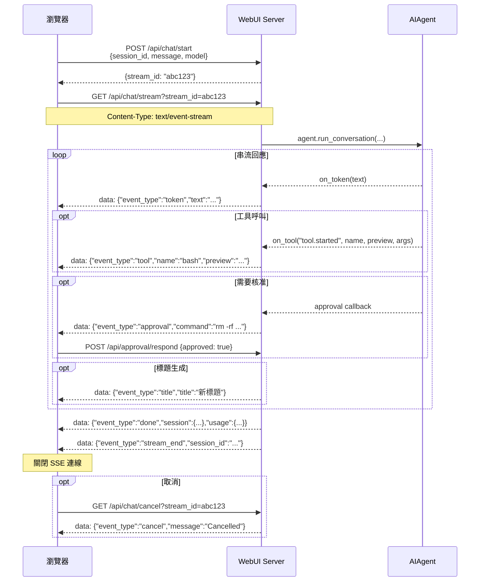

# Hermes Web UI — API 參考文件（API_SURFACE）

> 版本：v0.50.245（May 2026）  
> 來源程式碼：`api/routes.py`（~4100 行）、`api/streaming.py`（~660 行）、`api/auth.py`（~201 行）

---

## 目錄

1. [認證模式（Authentication）](#1-認證模式)
2. [CSRF 保護](#2-csrf-保護)
3. [Error Handling Pattern](#3-error-handling-pattern)
4. [SSE 串流協定](#4-sse-串流協定)
5. [Core — 健康、Session、Chat](#5-core--健康session-和-chat)
6. [Workspace — 檔案與工作目錄](#6-workspace--檔案與工作目錄)
7. [Skills / Cron / Memory](#7-skills--cron--memory)
8. [Auth — 認證](#8-auth--認證)
9. [Onboarding — 初始設定精靈](#9-onboarding--初始設定精靈)
10. [完整 Endpoint 清單](#10-完整-endpoint-清單)

---

## 1. 認證模式

### 機制：HMAC Cookie（可選）

認證功能預設**關閉**。啟用方式：
- 環境變數 `HERMES_WEBUI_PASSWORD=<密碼>`，或
- 透過 Settings 面板在 `~/.hermes/webui/settings.json` 中寫入 `password_hash`

**來源**：`api/auth.py:1-30`

| 項目 | 值 |
|------|----|
| Cookie 名稱 | `hermes_session` |
| Token 格式 | 隨機 hex（`secrets.token_hex()`） |
| TTL | 30 天（`SESSION_TTL = 86400 * 30`，`api/auth.py:17`） |
| 儲存位置 | `~/.hermes/webui/.sessions.json`（原子寫入，0600 權限） |
| 密碼 hash | bcrypt（`password_hash` 欄位） |
| 優先級 | `HERMES_WEBUI_PASSWORD` 環境變數優先於 settings.json |

### PUBLIC_PATHS（免認證路徑）

以下路徑不需要任何認證即可存取（**來源**：`api/auth.py:19-22`）：

```python
PUBLIC_PATHS = frozenset({
    '/login', '/health', '/favicon.ico',
    '/api/auth/login', '/api/auth/status',
    '/manifest.json', '/manifest.webmanifest',
})
```

### 每個請求的認證流程

```
do_GET/POST/PATCH/DELETE
  → check_auth(handler, parsed)
      → 若 parsed.path 在 PUBLIC_PATHS → 放行
      → 若未啟用認證 → 放行
      → parse_cookie(handler) → verify_session(token)
          → 通過：繼續路由
          → 失敗：302 重定向到 /login
```

### 登入限流

- `api/auth.py` 內建 rate limiter：同一 IP 1 分鐘內嘗試次數過多 → HTTP 429

---

## 2. CSRF 保護

所有 `POST`、`PATCH`、`DELETE` 請求皆驗證 Origin 或 Referer header（**來源**：`api/routes.py:647-700`）：

- 無 Origin 且無 Referer（如 curl、agent 等非瀏覽器客戶端）→ **放行**
- Origin/Referer 的 host 與 `Host` header 匹配 → **放行**
- 可透過環境變數 `HERMES_WEBUI_ALLOWED_ORIGINS=https://myapp.example.com` 允許額外來源
- 違反 → HTTP 403 `{"error": "Cross-origin request rejected"}`

---

## 3. Error Handling Pattern

**來源**：`api/helpers.py:17-19`、`api/helpers.py:67-90`

### 標準 JSON Error 格式

```json
{
  "error": "描述訊息"
}
```

### 常見 HTTP Status Codes

| Code | 情境 |
|------|------|
| 200 | 成功 |
| 400 | 請求格式錯誤、缺少必要欄位 |
| 401 | 密碼錯誤 |
| 403 | CSRF 驗證失敗、Onboarding 限制（非本地網路） |
| 404 | Session/資源不存在 |
| 409 | 衝突（如嘗試覆寫由環境變數設定的密碼） |
| 413 | 輸入過大（Terminal input > 8192 bytes） |
| 429 | 登入嘗試次數過多 |
| 500 | 伺服器內部錯誤 |

### 安全回應 Headers

每個回應都包含（**來源**：`api/helpers.py:38-55`）：

```
X-Content-Type-Options: nosniff
X-Frame-Options: DENY
Referrer-Policy: same-origin
Content-Security-Policy: default-src 'self' ...
Permissions-Policy: camera=(), microphone=(self), ...
```

---

## 4. SSE 串流協定

Hermes Web UI 使用 **Server-Sent Events（SSE）** 而非 WebSocket 進行即時串流。

### 連線步驟

```
1. POST /api/chat/start   → { stream_id, session_id }
2. GET  /api/chat/stream?stream_id=<id>   （保持連線，Content-Type: text/event-stream）
3. 接收 SSE events...
4. 接收 done / error / cancel → 客戶端關閉連線
```

### SSE Wire Format

```
data: {"event_type": "token", "text": "Hello"}

data: {"event_type": "done", "session": {...}, "usage": {...}}
```

每條 SSE 訊息格式：`data: <JSON>\n\n`。心跳（keepalive）：`: heartbeat\n\n`（每 N 秒發送）。

### 完整 Event Types

| Event | 說明 | Payload 重要欄位 |
|-------|------|----------------|
| `token` | AI 回覆文字的串流 token | `text: str` |
| `reasoning` | AI 思考鏈（Chain-of-Thought）文字片段 | `text: str` |
| `tool` | 工具呼叫進度通知 | `event_type`, `name`, `preview`, `args`, `done` |
| `approval` | 危險命令等待人類核准 | `session_id`, `command`, `description` |
| `title` | Session 標題已生成/更新 | `session_id: str`, `title: str` |
| `title_status` | 標題生成過程的狀態 | `session_id`, `status`, `reason`, `title` |
| `done` | Agent 本次對話完成 | `session`, `usage` (含 token 用量) |
| `stream_end` | 串流結束（含標題生成後） | `session_id: str` |
| `error` | Agent 執行錯誤 | `message: str`, `type: str` |
| `cancel` | 使用者取消了串流 | `message: str` |
| `metering` | 即時 token/cost 計量 | `session_id`, `tps_available`, `estimated` |
| `pending_steer_leftover` | `/steer` 指令未消費殘留 | `session_id`, `text` |

**來源**：`api/streaming.py:1491-1500`、`api/streaming.py:1671`、`api/streaming.py:1747`、`api/streaming.py:2157`、`api/streaming.py:2611`

### `tool` Event 的 `event_type` 子類型

| 子類型 | 說明 |
|--------|------|
| `tool.started` | 工具開始執行 |
| `tool.completed` | 工具執行完成 |
| `reasoning.available` | 模型輸出了 reasoning trace |

### SSE 流程圖（Mermaid）



### Gateway SSE 串流（獨立端點）

```
GET /api/sessions/gateway/stream
```

專用於 Telegram/Discord/Slack 等 messaging platform 的 session 即時更新推送（`api/gateway_watcher.py`）。

---

## 5. Core — 健康、Session 和 Chat

### Health

#### `GET /health`

健康檢查，不需要認證。

**Response 200**：
```json
{"status": "ok"}
```

---

### Session 管理

#### `GET /api/session?session_id=<sid>`

取得單一 session 的完整資料（含 messages）。

**Query Params**：
- `session_id`（必要）
- `messages=0`：略過 messages payload，加快 sidebar 切換速度

**Response 200**：
```json
{
  "session": {
    "session_id": "abc123def456",
    "title": "My Conversation",
    "model": "anthropic/claude-sonnet-4.6",
    "workspace": "/home/user/project",
    "messages": [...],
    "created_at": 1714000000,
    "updated_at": 1714001000
  }
}
```

---

#### `GET /api/sessions`

列出所有 session（含 CLI sessions、按 `last_message_at` 倒序排列）。

**Query Params**：
- `all_profiles=1`：顯示所有 profile 的 sessions（預設只顯示當前 profile）

**Response 200**：
```json
{
  "sessions": [...],
  "cli_count": 5,
  "all_profiles": false,
  "active_profile": "default",
  "other_profile_count": 3,
  "server_time": 1714000000.0,
  "server_tz": "+0800"
}
```

---

#### `GET /api/session/status?session_id=<sid>`

查詢 session 是否有 active stream。

**Response 200**：
```json
{"active": true, "stream_id": "abc123"}
```

---

#### `POST /api/session/new`

建立新 session。

**Request Body**：
```json
{
  "workspace": "/home/user/project",
  "model": "anthropic/claude-sonnet-4.6",
  "model_provider": "anthropic",
  "profile": "default",
  "project_id": "proj_abc"
}
```

**Response 200**：
```json
{
  "session": {
    "session_id": "abc123",
    "title": "Untitled",
    "messages": [],
    ...
  }
}
```

---

#### `POST /api/session/duplicate`

複製現有 session（深度複製 messages）。

**Request Body**：`{"session_id": "abc123"}`

**Response 200**：`{"session": {...}}`

---

#### `POST /api/session/rename`

重新命名 session。

**Request Body**：`{"session_id": "abc123", "title": "新標題"}`

---

#### `POST /api/session/delete`

刪除 session（及其對應的 JSON 檔案）。

**Request Body**：`{"session_id": "abc123"}`

---

#### `POST /api/session/clear`

清空 session 中所有 messages。

**Request Body**：`{"session_id": "abc123"}`

---

#### `POST /api/session/branch`

從 session 建立分支（branch），可指定 message index。

**Request Body**：`{"session_id": "abc123", "message_index": 5}`

---

#### `POST /api/session/pin`

釘選/取消釘選 session。

**Request Body**：`{"session_id": "abc123", "pinned": true}`

---

#### `POST /api/session/archive`

封存/取消封存 session。

**Request Body**：`{"session_id": "abc123", "archived": true}`

---

#### `POST /api/session/move`

移動 session 至不同 project。

**Request Body**：`{"session_id": "abc123", "project_id": "proj_xyz"}`

---

#### `POST /api/session/update`

更新 session 的 metadata（如 workspace、model）。

---

#### `POST /api/session/compress`

壓縮 session context（去除多餘 token，縮短 context window）。

---

#### `POST /api/session/truncate`

截斷 session 到指定 message 數量。

---

#### `POST /api/session/retry`

重試最後一條 user message。

---

#### `POST /api/session/undo`

撤銷最後一條 assistant 回覆。

---

#### `POST /api/session/yolo`

切換 YOLO 模式（自動核准所有工具呼叫）。

`GET /api/session/yolo?session_id=<sid>`：查詢目前 YOLO 狀態。

---

#### `POST /api/session/toolsets`

設定 session 啟用的 toolsets 清單。

**Request Body**：`{"session_id": "abc123", "toolsets": ["file", "terminal", "web"]}`

---

#### `GET /api/session/export?session_id=<sid>`

匯出 session 為 JSON 檔案（下載）。

---

#### `POST /api/session/import`

匯入 session JSON 檔案。

---

#### `POST /api/session/import_cli`

從 hermes-agent CLI 的 SQLite DB 匯入 session。

---

#### `GET /api/sessions/search?q=<query>`

全文搜尋 session 標題。

---

#### `POST /api/sessions/cleanup`

清理空 session。

---

#### `GET /api/session/usage?session_id=<sid>`

取得 session 的 token 使用量統計。

---

#### `GET /api/session/conversation-rounds?session_id=<sid>`

取得 session 的對話輪次數。

---

#### `GET /api/session/handoff-summary?session_id=<sid>`

取得 session 的摘要（用於 context handoff）。

---

### Chat（核心對話）

#### `POST /api/chat/start`

啟動一次 agent 對話，建立 SSE stream。

**Request Body**：
```json
{
  "session_id": "abc123",
  "message": "請幫我分析這段程式碼",
  "model": "anthropic/claude-sonnet-4.6",
  "model_provider": "anthropic",
  "workspace": "/home/user/project",
  "attachments": []
}
```

**Response 200**：
```json
{
  "stream_id": "xyz789",
  "session_id": "abc123"
}
```

接著用 `stream_id` 建立 SSE 連線：`GET /api/chat/stream?stream_id=xyz789`

---

#### `GET /api/chat/stream?stream_id=<id>`

SSE 串流端點。保持長連線，逐一推送 SSE events（詳見第 4 節）。

**Headers**：
```
Content-Type: text/event-stream; charset=utf-8
Cache-Control: no-cache
X-Accel-Buffering: no
Connection: keep-alive
```

串流結束條件：收到 `stream_end`、`error`、或 `cancel` event。

---

#### `GET /api/chat/stream/status?stream_id=<id>`

查詢指定 stream 是否仍在執行中。

**Response 200**：`{"active": true, "stream_id": "xyz789"}`

---

#### `GET /api/chat/cancel?stream_id=<id>`

取消正在執行的 agent stream。

**Response 200**：`{"ok": true, "cancelled": true, "stream_id": "xyz789"}`

---

#### `POST /api/chat`

同步（非串流）chat，等待完整回覆後才回應（較少用）。

---

#### `POST /api/chat/steer`

在 agent 執行中途注入額外指示（mid-stream steering）。

**Request Body**：`{"session_id": "abc123", "text": "請用繁體中文回覆"}`

---

#### `POST /api/btw`

Ephemeral（短暫）對話，不儲存到 session history。

---

### Approval（人工核准）

#### `GET /api/approval/pending?session_id=<sid>`

查詢等待核准的危險命令。

---

#### `GET /api/approval/stream?session_id=<sid>`

SSE 串流：等待核准事件推送。

---

#### `POST /api/approval/respond`

回覆核准請求。

**Request Body**：`{"session_id": "abc123", "approved": true}`

---

### Clarify（澄清問題）

#### `GET /api/clarify/pending?session_id=<sid>`

查詢等待回答的澄清問題。

---

#### `GET /api/clarify/stream?session_id=<sid>`

SSE 串流：等待澄清問題推送。

---

#### `POST /api/clarify/respond`

回答澄清問題。

**Request Body**：`{"session_id": "abc123", "choice": "選項A"}`

---

### Settings & Models

#### `GET /api/settings`

取得使用者設定（不含 `password_hash`）。

**Response 200**：
```json
{
  "model": "anthropic/claude-sonnet-4.6",
  "send_key": "enter",
  "show_cli_sessions": false,
  "password_env_var": false,
  "webui_version": "v0.50.245",
  "agent_version": "..."
}
```

---

#### `POST /api/settings`

儲存使用者設定。特殊欄位：
- `_set_password`：設定登入密碼
- `_clear_password`：清除密碼

若 `HERMES_WEBUI_PASSWORD` 環境變數已設定，修改密碼操作 → HTTP 409。

---

#### `GET /api/models`

取得可用的 AI model 清單（含 provider 資訊）。

---

#### `GET /api/models/live`

即時從 AI provider 取得最新 model 清單。

---

#### `POST /api/default-model`

設定預設 model。

---

#### `GET /api/reasoning`

取得 reasoning（Chain-of-Thought）設定狀態。

---

#### `POST /api/reasoning`

更新 reasoning 設定（`show_reasoning`、`reasoning_effort`）。

---

#### `GET /api/updates/check`

查詢是否有新版本可用（向 GitHub Releases API 查詢）。

**Response 200**：
```json
{
  "available": true,
  "current": "v0.50.245",
  "latest": "v0.50.291",
  "url": "https://github.com/nesquena/hermes-webui/releases/..."
}
```

---

#### `POST /api/updates/apply` / `POST /api/updates/force`

觸發自我更新。

---

#### `GET /api/insights`

取得統計分析資料（message count 等，來自 `state_sync.py`）。

---

#### `POST /api/admin/reload`

重新載入設定（無需重啟伺服器）。

---

## 6. Workspace — 檔案與工作目錄

### Workspaces

#### `GET /api/workspaces`

列出已登錄的 workspace 清單。

---

#### `GET /api/workspaces/suggest`

自動建議可用的 workspace 目錄。

---

#### `POST /api/workspaces/add`

新增 workspace 到清單。

**Request Body**：`{"path": "/home/user/project"}`

---

#### `POST /api/workspaces/remove`

移除 workspace。

**Request Body**：`{"path": "/home/user/project"}`

---

#### `POST /api/workspaces/rename`

重新命名 workspace 顯示名稱。

---

#### `POST /api/workspaces/reorder`

調整 workspace 排列順序。

---

### 檔案操作

#### `GET /api/list?path=<dir>&session_id=<sid>`

列出目錄內容（workspace sandbox 內）。

---

#### `GET /api/file?path=<file>&session_id=<sid>`

讀取檔案內容（metadata + 內容）。

---

#### `GET /api/file/raw?path=<file>&session_id=<sid>`

讀取檔案原始位元組（用於下載）。

---

#### `POST /api/file/save`

儲存檔案內容。

**Request Body**：`{"path": "src/main.py", "content": "...", "session_id": "abc123"}`

---

#### `POST /api/file/create`

建立新檔案。

---

#### `POST /api/file/create-dir`

建立新目錄。

---

#### `POST /api/file/rename`

重新命名檔案/目錄。

---

#### `POST /api/file/delete`

刪除檔案（限 workspace sandbox 內）。

---

#### `POST /api/file/reveal`

在系統檔案管理員中顯示檔案位置（桌面環境）。

---

#### `GET /api/git-info?session_id=<sid>`

取得 workspace 的 git 狀態（branch、uncommitted changes 等）。

---

#### `GET /api/media?path=<file>&session_id=<sid>`

提供圖片/媒體檔案（用於 chat 中的圖片預覽）。

---

### Rollback（版本回滾）

#### `GET /api/rollback/list?workspace=<path>`

列出 workspace 可用的 checkpoint 清單。

---

#### `GET /api/rollback/diff?workspace=<path>&checkpoint=<id>`

預覽 checkpoint 與目前狀態的差異（diff）。

---

#### `POST /api/rollback/restore`

還原到指定 checkpoint。

**Request Body**：`{"workspace": "/home/user/project", "checkpoint": "ckpt_abc"}`

---

### Upload & Transcribe

#### `POST /api/upload`

上傳檔案附件（multipart/form-data）。

---

#### `POST /api/upload/extract`

解壓縮上傳的 ZIP 或 tar 檔案。

---

#### `POST /api/transcribe`

語音轉文字（Audio → text，Web Speech API 輔助）。

---

### Projects

#### `GET /api/projects`

列出所有 project（session 分組）。

**Query Params**：`all_profiles=1`（顯示所有 profile 的 projects）

---

#### `POST /api/projects/create`

建立新 project。

**Request Body**：`{"name": "My Project"}`

---

#### `POST /api/projects/rename`

重新命名 project。

---

#### `POST /api/projects/delete`

刪除 project（不刪除其中的 sessions）。

---

## 7. Skills / Cron / Memory

### Skills（技能）

#### `GET /api/skills`

列出所有 skills（來自 hermes-agent `tools.skills_tool`）。

---

#### `GET /api/skills/content?name=<skill>`

取得指定 skill 的完整內容。

---

#### `POST /api/skills/save`

儲存（新增或更新）skill。

**Request Body**：`{"name": "my_skill", "content": "..."}`

---

#### `POST /api/skills/delete`

刪除 skill。

**Request Body**：`{"name": "my_skill"}`

---

### Cron Jobs

#### `GET /api/crons`

列出所有 cron jobs（來自 hermes-agent `cron.jobs`）。

---

#### `GET /api/crons/output?job_id=<id>`

取得 cron job 的輸出內容。

---

#### `GET /api/crons/history`

取得 cron job 執行歷史。

---

#### `GET /api/crons/recent`

取得最近執行的 cron job 清單。

---

#### `GET /api/crons/status`

取得 cron 系統狀態。

---

#### `POST /api/crons/create`

建立新 cron job。

**Request Body**：
```json
{
  "name": "daily_report",
  "schedule": "0 9 * * *",
  "task": "生成每日報告"
}
```

---

#### `POST /api/crons/update`

更新 cron job 設定。

---

#### `POST /api/crons/delete`

刪除 cron job。

**Request Body**：`{"job_id": "cron_abc"}`

---

#### `POST /api/crons/run` （GET 亦支援）

立即手動執行 cron job。

---

#### `POST /api/crons/pause`

暫停 cron job。

---

#### `POST /api/crons/resume`

恢復暫停的 cron job。

---

### Memory

#### `GET /api/memory`

讀取 agent memory（`MEMORY.md` + `USER.md`）。

---

#### `POST /api/memory/write`

寫入 agent memory。

**Request Body**：`{"content": "使用者偏好...", "file": "MEMORY"}`

---

## 8. Auth — 認證

#### `GET /api/auth/status`

查詢認證狀態（不需要認證即可存取）。

**Response 200**：
```json
{
  "auth_enabled": true,
  "logged_in": true
}
```

---

#### `POST /api/auth/login`

登入（驗證密碼，建立 session）。

**Request Body**：`{"password": "mypassword"}`

**Response 200**（成功）：
```json
{"ok": true}
```
同時設定 `Set-Cookie: hermes_session=<token>; HttpOnly; SameSite=Lax; Max-Age=2592000`

**Response 401**（失敗）：`{"error": "Invalid password"}`

**Response 429**（限流）：`{"error": "Too many attempts. Try again in a minute."}`

---

#### `POST /api/auth/logout`

登出（清除 cookie，invalidate session token）。

**Response 200**：`{"ok": true}`

---

### Profile 管理

#### `GET /api/profiles`

列出所有 profiles 及當前 active profile。

**Response 200**：
```json
{
  "profiles": [...],
  "active": "default"
}
```

---

#### `GET /api/profile/active`

取得當前 active profile 名稱及路徑。

**Response 200**：
```json
{
  "name": "default",
  "path": "/home/user/.hermes"
}
```

---

#### `POST /api/profile/switch`

切換 active profile（設定 Cookie，不影響其他並行 tab）。

**Request Body**：`{"name": "work"}`

---

#### `POST /api/profile/create`

建立新 profile。

**Request Body**：`{"name": "work"}`

---

#### `POST /api/profile/delete`

刪除 profile。

---

#### `POST /api/personality/set`

設定 AI 個性（persona）。

---

### Providers

#### `GET /api/providers`

列出已設定的 AI provider 及 API key 狀態。

---

#### `POST /api/providers`

新增或更新 provider 設定（API key、base URL 等）。

---

#### `POST /api/providers/delete`

刪除 provider 設定。

---

### Gateway

#### `GET /api/gateway/status`

取得 messaging gateway（Telegram/Discord/Slack 等）連線狀態。

**Response 200**：
```json
{
  "running": true,
  "platforms": [
    {"name": "telegram", "label": "Telegram"},
    {"name": "discord", "label": "Discord"}
  ],
  "last_active": "2026-05-05T10:30:00",
  "session_count": 12
}
```

---

#### `GET /api/sessions/gateway/stream`

SSE 串流：gateway session 即時更新推送（sidebar badge 更新）。

---

### MCP Servers

#### `GET /api/mcp/servers`

列出已設定的 MCP（Model Context Protocol）server。

---

#### `GET /api/mcp/tools`

列出可用的 MCP tools。

---

### 其他管理

#### `GET /api/dashboard/status`

Dashboard 伺服器狀態（若有部署）。

---

#### `GET /api/dashboard/config` / `POST /api/dashboard/config`

讀取/更新 dashboard 設定。

---

#### `GET /api/plugins`

列出已安裝的 WebUI 擴充套件（extensions）。

---

#### `GET /api/background/status`

背景任務狀態。

---

#### `POST /api/background`

觸發背景任務。

---

### Terminal

#### `POST /api/terminal/start`

在 workspace 目錄中啟動終端機 session。

**Request Body**：
```json
{
  "session_id": "abc123",
  "rows": 24,
  "cols": 80,
  "restart": false
}
```

---

#### `POST /api/terminal/input`

傳送輸入到終端機（限 8192 bytes）。

**Request Body**：`{"session_id": "abc123", "data": "ls -la\r"}`

---

#### `POST /api/terminal/resize`

調整終端機視窗大小（SIGWINCH）。

**Request Body**：`{"session_id": "abc123", "rows": 40, "cols": 120}`

---

#### `POST /api/terminal/close`

關閉終端機 session。

---

#### `GET /api/terminal/output?session_id=<sid>`

SSE 串流：終端機輸出即時推送。

---

## 9. Onboarding — 初始設定精靈

Onboarding 端點在**未啟用認證**時限制只允許本地網路（loopback 或 private IP）存取，避免遠端使用者竊取 API keys。環境變數 `HERMES_WEBUI_ONBOARDING_OPEN=1` 可放寬此限制（用於有防火牆保護的遠端伺服器）。

---

#### `GET /api/onboarding/status`

查詢 onboarding 是否已完成。

**Response 200**：
```json
{
  "completed": false,
  "providers_configured": [],
  "step": "welcome"
}
```

---

#### `POST /api/onboarding/setup`

套用 onboarding 設定（寫入 API keys 到 `~/.hermes/`）。

**Request Body**：
```json
{
  "provider": "anthropic",
  "api_key": "sk-ant-...",
  "model": "claude-sonnet-4.6"
}
```

**限制**：僅本地網路（或 `HERMES_WEBUI_ONBOARDING_OPEN=1`）

---

#### `POST /api/onboarding/complete`

標記 onboarding 已完成。

---

#### `POST /api/onboarding/probe`

探測自建 provider endpoint 是否可連接（讀取 `/models` 清單）。

**Request Body**：
```json
{
  "base_url": "http://localhost:11434",
  "api_key": "optional"
}
```

---

#### `POST /api/onboarding/oauth/start`

啟動 OAuth 授權流程（用於 provider OAuth 認證）。

**限制**：同 `/api/onboarding/setup`

---

#### `GET /api/onboarding/oauth/poll`

輪詢 OAuth 授權狀態。

---

#### `POST /api/onboarding/oauth/cancel`

取消 OAuth 授權流程。

---

#### `GET /api/commands`

取得可用的 slash commands 清單（用於前端 autocomplete）。

---

#### `GET /api/personalities`

取得可用的 personality 清單。

---

## 10. 完整 Endpoint 清單

### GET 端點

| Path | 說明 |
|------|------|
| `/health` | 健康檢查 |
| `/api/auth/status` | 認證狀態 |
| `/api/models` | 可用 model 清單 |
| `/api/models/live` | 即時 model 清單 |
| `/api/settings` | 使用者設定 |
| `/api/reasoning` | Reasoning 設定 |
| `/api/sessions` | Session 清單 |
| `/api/session` | 單一 session 詳情 |
| `/api/session/status` | Session stream 狀態 |
| `/api/session/yolo` | YOLO 模式狀態 |
| `/api/session/usage` | Token 使用量 |
| `/api/session/export` | 匯出 session |
| `/api/session/conversation-rounds` | 對話輪次 |
| `/api/session/handoff-summary` | Session 摘要 |
| `/api/sessions/search` | 搜尋 sessions |
| `/api/projects` | Project 清單 |
| `/api/workspaces` | Workspace 清單 |
| `/api/workspaces/suggest` | Workspace 建議 |
| `/api/list` | 目錄內容 |
| `/api/file` | 讀取檔案 |
| `/api/file/raw` | 下載檔案原始資料 |
| `/api/git-info` | Git 狀態 |
| `/api/media` | 媒體檔案 |
| `/api/chat/stream` | SSE Chat 串流 |
| `/api/chat/stream/status` | Stream 狀態 |
| `/api/chat/cancel` | 取消 Stream |
| `/api/approval/pending` | 待核准項目 |
| `/api/approval/stream` | Approval SSE |
| `/api/clarify/pending` | 待澄清問題 |
| `/api/clarify/stream` | Clarify SSE |
| `/api/terminal/output` | 終端機輸出 SSE |
| `/api/sessions/gateway/stream` | Gateway SSE |
| `/api/skills` | Skills 清單 |
| `/api/skills/content` | Skill 內容 |
| `/api/crons` | Cron jobs 清單 |
| `/api/crons/output` | Cron job 輸出 |
| `/api/crons/history` | Cron 歷史 |
| `/api/crons/recent` | 最近 Cron |
| `/api/crons/status` | Cron 狀態 |
| `/api/memory` | Agent memory |
| `/api/profiles` | Profile 清單 |
| `/api/profile/active` | Active profile |
| `/api/providers` | Provider 設定 |
| `/api/plugins` | 擴充套件 |
| `/api/gateway/status` | Gateway 狀態 |
| `/api/mcp/servers` | MCP servers |
| `/api/mcp/tools` | MCP tools |
| `/api/rollback/list` | Checkpoint 清單 |
| `/api/rollback/diff` | Checkpoint diff |
| `/api/onboarding/status` | Onboarding 狀態 |
| `/api/onboarding/oauth/poll` | OAuth 輪詢 |
| `/api/updates/check` | 更新檢查 |
| `/api/commands` | Slash commands |
| `/api/personalities` | Personality 清單 |
| `/api/background/status` | 背景任務狀態 |
| `/api/dashboard/status` | Dashboard 狀態 |
| `/api/dashboard/config` | Dashboard 設定 |
| `/api/insights` | 統計分析 |

### POST 端點

| Path | 說明 |
|------|------|
| `/api/auth/login` | 登入 |
| `/api/auth/logout` | 登出 |
| `/api/session/new` | 建立 session |
| `/api/session/duplicate` | 複製 session |
| `/api/session/rename` | 重新命名 |
| `/api/session/delete` | 刪除 session |
| `/api/session/clear` | 清空 messages |
| `/api/session/branch` | 建立分支 |
| `/api/session/update` | 更新 metadata |
| `/api/session/truncate` | 截斷 session |
| `/api/session/compress` | 壓縮 context |
| `/api/session/retry` | 重試最後訊息 |
| `/api/session/undo` | 撤銷回覆 |
| `/api/session/yolo` | 切換 YOLO |
| `/api/session/toolsets` | 設定 toolsets |
| `/api/session/pin` | 釘選 session |
| `/api/session/archive` | 封存 session |
| `/api/session/move` | 移動至 project |
| `/api/session/import` | 匯入 session |
| `/api/session/import_cli` | 匯入 CLI session |
| `/api/sessions/cleanup` | 清理空 sessions |
| `/api/sessions/cleanup_zero_message` | 清理零訊息 sessions |
| `/api/projects/create` | 建立 project |
| `/api/projects/rename` | 重新命名 project |
| `/api/projects/delete` | 刪除 project |
| `/api/chat/start` | 啟動 chat stream |
| `/api/chat` | 同步 chat |
| `/api/chat/steer` | Mid-stream steering |
| `/api/btw` | Ephemeral 對話 |
| `/api/background` | 背景任務 |
| `/api/approval/respond` | 核准/拒絕工具 |
| `/api/clarify/respond` | 回答澄清問題 |
| `/api/terminal/start` | 啟動終端機 |
| `/api/terminal/input` | 終端機輸入 |
| `/api/terminal/resize` | 調整終端機大小 |
| `/api/terminal/close` | 關閉終端機 |
| `/api/skills/save` | 儲存 skill |
| `/api/skills/delete` | 刪除 skill |
| `/api/crons/create` | 建立 cron job |
| `/api/crons/update` | 更新 cron job |
| `/api/crons/delete` | 刪除 cron job |
| `/api/crons/run` | 立即執行 cron |
| `/api/crons/pause` | 暫停 cron |
| `/api/crons/resume` | 恢復 cron |
| `/api/memory/write` | 寫入 memory |
| `/api/profile/switch` | 切換 profile |
| `/api/profile/create` | 建立 profile |
| `/api/profile/delete` | 刪除 profile |
| `/api/personality/set` | 設定 personality |
| `/api/providers` | 儲存 provider |
| `/api/providers/delete` | 刪除 provider |
| `/api/settings` | 儲存設定 |
| `/api/reasoning` | 更新 reasoning |
| `/api/default-model` | 設定預設 model |
| `/api/workspaces/add` | 新增 workspace |
| `/api/workspaces/remove` | 移除 workspace |
| `/api/workspaces/rename` | 重新命名 workspace |
| `/api/workspaces/reorder` | 重新排序 workspace |
| `/api/file/save` | 儲存檔案 |
| `/api/file/create` | 建立檔案 |
| `/api/file/create-dir` | 建立目錄 |
| `/api/file/rename` | 重新命名檔案 |
| `/api/file/delete` | 刪除檔案 |
| `/api/file/reveal` | 在 Finder/Explorer 顯示 |
| `/api/rollback/restore` | 還原 checkpoint |
| `/api/upload` | 上傳檔案 |
| `/api/upload/extract` | 解壓縮檔案 |
| `/api/transcribe` | 語音轉文字 |
| `/api/onboarding/setup` | 套用 onboarding |
| `/api/onboarding/complete` | 完成 onboarding |
| `/api/onboarding/probe` | 探測 provider |
| `/api/onboarding/oauth/start` | 啟動 OAuth |
| `/api/onboarding/oauth/cancel` | 取消 OAuth |
| `/api/updates/apply` | 套用更新 |
| `/api/updates/force` | 強制更新 |
| `/api/admin/reload` | 重新載入設定 |
| `/api/dashboard/config` | 更新 Dashboard 設定 |

### PATCH / DELETE 端點

| Method | Path Pattern | 說明 |
|--------|-------------|------|
| PATCH | `/api/kanban/*` | Kanban board 操作（由 `api/kanban_bridge.py` 處理） |
| DELETE | `/api/kanban/*` | 刪除 Kanban 項目 |

---

*文件最後更新：2026-05-05*  
*程式碼來源：`api/routes.py`（handle_get L2033、handle_post L2878、handle_patch L4062、handle_delete L4074）、`api/streaming.py`、`api/auth.py`、`api/helpers.py`*
