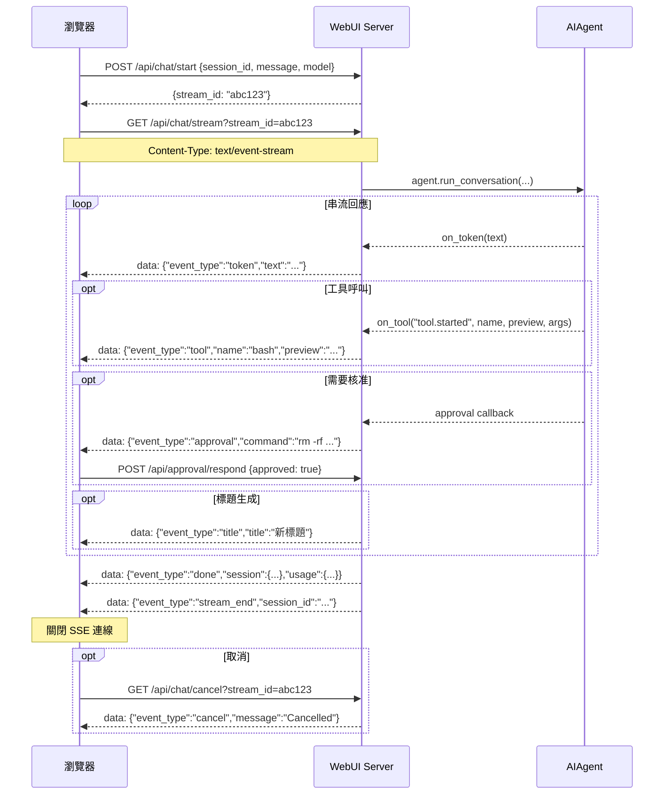

# Hermes Web UI — API 參考文件 Part 1（認證、SSE、Core）

> 版本：v0.50.245（May 2026）  
> 來源程式碼：`api/routes.py`（~4100 行）、`api/streaming.py`（~660 行）、`api/auth.py`（~201 行）  
> **Part 2**：[API_SURFACE_part2.md](API_SURFACE_part2.md)（Workspace、Skills/Cron/Memory、Auth、Onboarding、完整清單）

---

## 目錄

1. [認證模式（Authentication）](#1-認證模式)
2. [CSRF 保護](#2-csrf-保護)
3. [Error Handling Pattern](#3-error-handling-pattern)
4. [SSE 串流協定](#4-sse-串流協定)
5. [Core — 健康、Session 和 Chat](#5-core--健康session-和-chat)

---

## 1. 認證模式

### 機制：HMAC Cookie（可選）

認證功能預設**關閉**。啟用方式：
- 環境變數 `HERMES_WEBUI_PASSWORD=<密碼>`，或
- 透過 Settings 面板在 `~/.hermes/webui/settings.json` 中寫入 `password_hash`

**來源**：`api/auth.py:1-30`

| 項目 | 值 |
|------|----|
| Cookie 名稱 | `hermes_session` |
| Token 格式 | 隨機 hex（`secrets.token_hex()`） |
| TTL | 30 天（`SESSION_TTL = 86400 * 30`，`api/auth.py:17`） |
| 儲存位置 | `~/.hermes/webui/.sessions.json`（原子寫入，0600 權限） |
| 密碼 hash | bcrypt（`password_hash` 欄位） |
| 優先級 | `HERMES_WEBUI_PASSWORD` 環境變數優先於 settings.json |

### PUBLIC_PATHS（免認證路徑）

以下路徑不需要任何認證即可存取（**來源**：`api/auth.py:19-22`）：

```python
PUBLIC_PATHS = frozenset({
    '/login', '/health', '/favicon.ico',
    '/api/auth/login', '/api/auth/status',
    '/manifest.json', '/manifest.webmanifest',
})
```

### 每個請求的認證流程

```
do_GET/POST/PATCH/DELETE
  → check_auth(handler, parsed)
      → 若 parsed.path 在 PUBLIC_PATHS → 放行
      → 若未啟用認證 → 放行
      → parse_cookie(handler) → verify_session(token)
          → 通過：繼續路由
          → 失敗：302 重定向到 /login
```

### 登入限流

- `api/auth.py` 內建 rate limiter：同一 IP 1 分鐘內嘗試次數過多 → HTTP 429

---

## 2. CSRF 保護

所有 `POST`、`PATCH`、`DELETE` 請求皆驗證 Origin 或 Referer header（**來源**：`api/routes.py:647-700`）：

- 無 Origin 且無 Referer（如 curl、agent 等非瀏覽器客戶端）→ **放行**
- Origin/Referer 的 host 與 `Host` header 匹配 → **放行**
- 可透過環境變數 `HERMES_WEBUI_ALLOWED_ORIGINS=https://myapp.example.com` 允許額外來源
- 違反 → HTTP 403 `{"error": "Cross-origin request rejected"}`

---

## 3. Error Handling Pattern

**來源**：`api/helpers.py:17-19`、`api/helpers.py:67-90`

### 標準 JSON Error 格式

```json
{"error": "描述訊息"}
```

### 常見 HTTP Status Codes

| Code | 情境 |
|------|------|
| 200 | 成功 |
| 400 | 請求格式錯誤、缺少必要欄位 |
| 401 | 密碼錯誤 |
| 403 | CSRF 驗證失敗、Onboarding 限制（非本地網路） |
| 404 | Session/資源不存在 |
| 409 | 衝突（如嘗試覆寫由環境變數設定的密碼） |
| 413 | 輸入過大（Terminal input > 8192 bytes） |
| 429 | 登入嘗試次數過多 |
| 500 | 伺服器內部錯誤 |

### 安全回應 Headers（每個回應）

```
X-Content-Type-Options: nosniff
X-Frame-Options: DENY
Referrer-Policy: same-origin
Content-Security-Policy: default-src 'self' ...
Permissions-Policy: camera=(), microphone=(self), ...
```

---

## 4. SSE 串流協定

Hermes Web UI 使用 **Server-Sent Events（SSE）** 而非 WebSocket 進行即時串流。

### 連線步驟

```
1. POST /api/chat/start   → { stream_id, session_id }
2. GET  /api/chat/stream?stream_id=<id>   （保持連線）
3. 接收 SSE events...
4. 收到 stream_end / error / cancel → 客戶端關閉連線
```

### SSE Wire Format

```
data: {"event_type": "token", "text": "Hello"}\n\n
: heartbeat\n\n   （keepalive，每 N 秒）
```

### 完整 Event Types

| Event | 說明 | Payload 重要欄位 |
|-------|------|----------------|
| `token` | AI 回覆文字的串流 token | `text: str` |
| `reasoning` | AI 思考鏈（Chain-of-Thought）文字片段 | `text: str` |
| `tool` | 工具呼叫進度通知 | `event_type`, `name`, `preview`, `args`, `done` |
| `approval` | 危險命令等待人類核准 | `session_id`, `command`, `description` |
| `title` | Session 標題已生成/更新 | `session_id: str`, `title: str` |
| `title_status` | 標題生成過程的狀態 | `session_id`, `status`, `reason` |
| `done` | Agent 本次對話完成 | `session`, `usage` (含 token 用量) |
| `stream_end` | 串流結束（含標題生成後） | `session_id: str` |
| `error` | Agent 執行錯誤 | `message: str`, `type: str` |
| `cancel` | 使用者取消了串流 | `message: str` |
| `metering` | 即時 token/cost 計量 | `session_id`, `tps_available`, `estimated` |
| `pending_steer_leftover` | `/steer` 指令未消費殘留 | `session_id`, `text` |

**來源**：`api/streaming.py:1491`、`:1671`、`:1747`、`:2157`、`:2611`

### `tool` Event 的 `event_type` 子類型

| 子類型 | 說明 |
|--------|------|
| `tool.started` | 工具開始執行 |
| `tool.completed` | 工具執行完成 |
| `reasoning.available` | 模型輸出了 reasoning trace |

### SSE 流程圖（Mermaid）



### Gateway SSE 串流

`GET /api/sessions/gateway/stream` — 專用於 Telegram/Discord/Slack messaging platform 的 sidebar 即時更新（`api/gateway_watcher.py`）。

---

## 5. Core — 健康、Session 和 Chat

### `GET /health`

健康檢查，不需要認證（在 PUBLIC_PATHS 中）。

**Response 200**：`{"status": "ok"}`

---

### Session 管理

#### `GET /api/session?session_id=<sid>`

取得單一 session 的完整資料（`api/routes.py:2225`）。

**Query Params**：
- `session_id`（必要）
- `messages=0`：略過 messages payload，加快 sidebar 切換速度

**Response 200**：
```json
{
  "session": {
    "session_id": "abc123def456",
    "title": "My Conversation",
    "model": "anthropic/claude-sonnet-4.6",
    "workspace": "/home/user/project",
    "messages": [...],
    "created_at": 1714000000,
    "updated_at": 1714001000
  }
}
```

---

#### `GET /api/sessions`

列出所有 session（含 CLI sessions、按 `last_message_at` 倒序，`api/routes.py:2431`）。

**Query Params**：`all_profiles=1`（顯示所有 profile 的 sessions）

**Response 200**：
```json
{
  "sessions": [...],
  "cli_count": 5,
  "all_profiles": false,
  "active_profile": "default",
  "other_profile_count": 3,
  "server_time": 1714000000.0,
  "server_tz": "+0800"
}
```

---

#### `POST /api/session/new`

建立新 session（`api/routes.py:2910`）。

**Request Body**：
```json
{
  "workspace": "/home/user/project",
  "model": "anthropic/claude-sonnet-4.6",
  "model_provider": "anthropic",
  "profile": "default",
  "project_id": "proj_abc"
}
```

**Response 200**：`{"session": {"session_id": "abc123", "title": "Untitled", "messages": [], ...}}`

---

#### Session 操作快速參考

| Endpoint | Method | 說明 | Request 必要欄位 |
|----------|--------|------|-----------------|
| `/api/session/status` | GET | Stream 狀態 | `?session_id=` |
| `/api/session/duplicate` | POST | 深度複製 session | `session_id` |
| `/api/session/rename` | POST | 重新命名 | `session_id`, `title` |
| `/api/session/delete` | POST | 刪除 | `session_id` |
| `/api/session/clear` | POST | 清空 messages | `session_id` |
| `/api/session/branch` | POST | 建立分支 | `session_id`, `message_index` |
| `/api/session/pin` | POST | 釘選/取消釘選 | `session_id`, `pinned` |
| `/api/session/archive` | POST | 封存/取消封存 | `session_id`, `archived` |
| `/api/session/move` | POST | 移動至 project | `session_id`, `project_id` |
| `/api/session/update` | POST | 更新 metadata | `session_id` |
| `/api/session/compress` | POST | 壓縮 context | `session_id` |
| `/api/session/truncate` | POST | 截斷 messages | `session_id` |
| `/api/session/retry` | POST | 重試最後訊息 | `session_id` |
| `/api/session/undo` | POST | 撤銷最後回覆 | `session_id` |
| `/api/session/yolo` | GET/POST | YOLO 模式切換 | `session_id` |
| `/api/session/toolsets` | POST | 設定 toolsets | `session_id`, `toolsets` |
| `/api/session/export` | GET | 匯出 JSON | `?session_id=` |
| `/api/session/import` | POST | 匯入 JSON | session JSON |
| `/api/session/import_cli` | POST | 匯入 CLI session | `session_id` |
| `/api/session/usage` | GET | Token 用量 | `?session_id=` |
| `/api/session/conversation-rounds` | GET | 對話輪次 | `?session_id=` |
| `/api/session/handoff-summary` | GET | Context 摘要 | `?session_id=` |
| `/api/sessions/search` | GET | 搜尋標題 | `?q=` |
| `/api/sessions/cleanup` | POST | 清理空 sessions | — |

---

### Chat（核心對話）

#### `POST /api/chat/start`

啟動一次 agent 對話，建立 SSE stream（`api/routes.py:3425`）。

**Request Body**：
```json
{
  "session_id": "abc123",
  "message": "請幫我分析這段程式碼",
  "model": "anthropic/claude-sonnet-4.6",
  "model_provider": "anthropic",
  "workspace": "/home/user/project",
  "attachments": []
}
```

**Response 200**：`{"stream_id": "xyz789", "session_id": "abc123"}`

接著建立 SSE 連線：`GET /api/chat/stream?stream_id=xyz789`

---

#### `GET /api/chat/stream?stream_id=<id>`

SSE 串流端點（`api/routes.py:4231`）。保持長連線，逐一推送 SSE events（詳見第 4 節）。

串流結束條件：收到 `stream_end`、`error`、或 `cancel` event。

---

#### Chat 操作快速參考

| Endpoint | Method | 說明 |
|----------|--------|------|
| `/api/chat/stream/status` | GET | 查詢 `?stream_id=` 是否活躍 |
| `/api/chat/cancel` | GET | 取消 stream（`?stream_id=`） |
| `/api/chat` | POST | 同步（非串流）chat |
| `/api/chat/steer` | POST | Mid-stream steering（`{"session_id":"...","text":"..."}`) |
| `/api/btw` | POST | Ephemeral 對話（不儲存） |

---

### Approval & Clarify

| Endpoint | Method | 說明 |
|----------|--------|------|
| `/api/approval/pending` | GET | 查詢待核准命令（`?session_id=`） |
| `/api/approval/stream` | GET | SSE：核准推送 |
| `/api/approval/respond` | POST | 核准/拒絕（`{"session_id":"...","approved":true}`） |
| `/api/clarify/pending` | GET | 查詢待澄清問題 |
| `/api/clarify/stream` | GET | SSE：澄清推送 |
| `/api/clarify/respond` | POST | 回答澄清（`{"session_id":"...","choice":"..."}`) |

---

### Settings & Models

#### `GET /api/settings`

取得使用者設定（不含 `password_hash`，`api/routes.py:2187`）。

**Response 200**（精簡）：
```json
{
  "model": "anthropic/claude-sonnet-4.6",
  "send_key": "enter",
  "show_cli_sessions": false,
  "password_env_var": false,
  "webui_version": "v0.50.245",
  "agent_version": "..."
}
```

---

#### `POST /api/settings`

儲存使用者設定。特殊欄位：`_set_password`（設定密碼）、`_clear_password`（清除密碼）。

若 `HERMES_WEBUI_PASSWORD` 環境變數已設定，修改密碼操作 → HTTP 409（`api/routes.py:3639-3646`）。

---

#### `GET /api/updates/check`

查詢是否有新版本（GitHub Releases API）。

**Response 200**：`{"available": true, "current": "v0.50.245", "latest": "v0.50.291", "url": "..."}`

---

*程式碼來源：`api/routes.py`（handle_get L2033、handle_post L2878）、`api/streaming.py`、`api/auth.py:1-80`*
