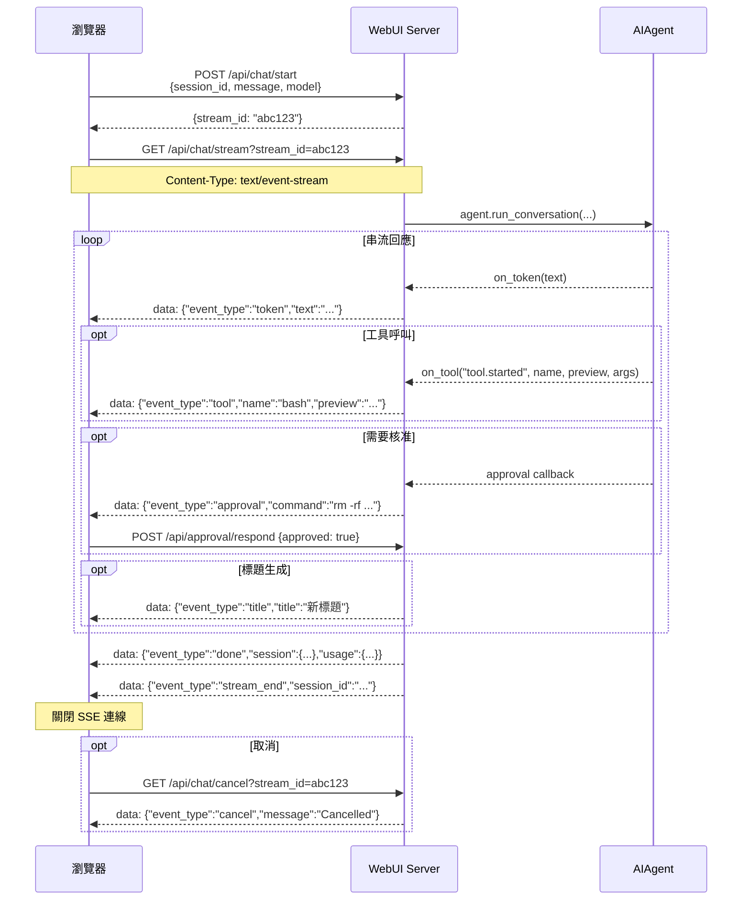

# Hermes Web UI — API 參考文件（API_SURFACE）

> 版本：v0.50.245（May 2026）  
> 來源程式碼：`api/routes.py`（~4100 行）、`api/streaming.py`（~660 行）、`api/auth.py`（~201 行）

---

## 目錄

1. [認證模式（Authentication）](#1-認證模式)
2. [CSRF 保護](#2-csrf-保護)
3. [Error Handling Pattern](#3-error-handling-pattern)
4. [SSE 串流協定](#4-sse-串流協定)
5. [Core — 健康、Session、Chat](#5-core--健康session-和-chat)
6. [Workspace — 檔案與工作目錄](#6-workspace--檔案與工作目錄)
7. [Skills / Cron / Memory](#7-skills--cron--memory)
8. [Auth — 認證](#8-auth--認證)
9. [Onboarding — 初始設定精靈](#9-onboarding--初始設定精靈)
10. [完整 Endpoint 清單](#10-完整-endpoint-清單)

---

## 1. 認證模式

### 機制：HMAC Cookie（可選）

認證功能預設**關閉**。啟用方式：
- 環境變數 `HERMES_WEBUI_PASSWORD=<密碼>`，或
- 透過 Settings 面板在 `~/.hermes/webui/settings.json` 中寫入 `password_hash`

**來源**：`api/auth.py:1-30`

| 項目 | 值 |
|------|----|
| Cookie 名稱 | `hermes_session` |
| Token 格式 | 隨機 hex（`secrets.token_hex()`） |
| TTL | 30 天（`SESSION_TTL = 86400 * 30`，`api/auth.py:17`） |
| 儲存位置 | `~/.hermes/webui/.sessions.json`（原子寫入，0600 權限） |
| 密碼 hash | bcrypt（`password_hash` 欄位） |
| 優先級 | `HERMES_WEBUI_PASSWORD` 環境變數優先於 settings.json |

### PUBLIC_PATHS（免認證路徑）

以下路徑不需要任何認證即可存取（**來源**：`api/auth.py:19-22`）：

```python
PUBLIC_PATHS = frozenset({
    '/login', '/health', '/favicon.ico',
    '/api/auth/login', '/api/auth/status',
    '/manifest.json', '/manifest.webmanifest',
})
```

### 每個請求的認證流程

```
do_GET/POST/PATCH/DELETE
  → check_auth(handler, parsed)
      → 若 parsed.path 在 PUBLIC_PATHS → 放行
      → 若未啟用認證 → 放行
      → parse_cookie(handler) → verify_session(token)
          → 通過：繼續路由
          → 失敗：302 重定向到 /login
```

### 登入限流

- `api/auth.py` 內建 rate limiter：同一 IP 1 分鐘內嘗試次數過多 → HTTP 429

---

## 2. CSRF 保護

所有 `POST`、`PATCH`、`DELETE` 請求皆驗證 Origin 或 Referer header（**來源**：`api/routes.py:647-700`）：

- 無 Origin 且無 Referer（如 curl、agent 等非瀏覽器客戶端）→ **放行**
- Origin/Referer 的 host 與 `Host` header 匹配 → **放行**
- 可透過環境變數 `HERMES_WEBUI_ALLOWED_ORIGINS=https://myapp.example.com` 允許額外來源
- 違反 → HTTP 403 `{"error": "Cross-origin request rejected"}`

---

## 3. Error Handling Pattern

**來源**：`api/helpers.py:17-19`、`api/helpers.py:67-90`

### 標準 JSON Error 格式

```json
{
  "error": "描述訊息"
}
```

### 常見 HTTP Status Codes

| Code | 情境 |
|------|------|
| 200 | 成功 |
| 400 | 請求格式錯誤、缺少必要欄位 |
| 401 | 密碼錯誤 |
| 403 | CSRF 驗證失敗、Onboarding 限制（非本地網路） |
| 404 | Session/資源不存在 |
| 409 | 衝突（如嘗試覆寫由環境變數設定的密碼） |
| 413 | 輸入過大（Terminal input > 8192 bytes） |
| 429 | 登入嘗試次數過多 |
| 500 | 伺服器內部錯誤 |

### 安全回應 Headers

每個回應都包含（**來源**：`api/helpers.py:38-55`）：

```
X-Content-Type-Options: nosniff
X-Frame-Options: DENY
Referrer-Policy: same-origin
Content-Security-Policy: default-src 'self' ...
Permissions-Policy: camera=(), microphone=(self), ...
```

---

## 4. SSE 串流協定

Hermes Web UI 使用 **Server-Sent Events（SSE）** 而非 WebSocket 進行即時串流。

### 連線步驟

```
1. POST /api/chat/start   → { stream_id, session_id }
2. GET  /api/chat/stream?stream_id=<id>   （保持連線，Content-Type: text/event-stream）
3. 接收 SSE events...
4. 接收 done / error / cancel → 客戶端關閉連線
```

### SSE Wire Format

```
data: {"event_type": "token", "text": "Hello"}

data: {"event_type": "done", "session": {...}, "usage": {...}}
```

每條 SSE 訊息格式：`data: <JSON>\n\n`。心跳（keepalive）：`: heartbeat\n\n`（每 N 秒發送）。

### 完整 Event Types

| Event | 說明 | Payload 重要欄位 |
|-------|------|----------------|
| `token` | AI 回覆文字的串流 token | `text: str` |
| `reasoning` | AI 思考鏈（Chain-of-Thought）文字片段 | `text: str` |
| `tool` | 工具呼叫進度通知 | `event_type`, `name`, `preview`, `args`, `done` |
| `approval` | 危險命令等待人類核准 | `session_id`, `command`, `description` |
| `title` | Session 標題已生成/更新 | `session_id: str`, `title: str` |
| `title_status` | 標題生成過程的狀態 | `session_id`, `status`, `reason`, `title` |
| `done` | Agent 本次對話完成 | `session`, `usage` (含 token 用量) |
| `stream_end` | 串流結束（含標題生成後） | `session_id: str` |
| `error` | Agent 執行錯誤 | `message: str`, `type: str` |
| `cancel` | 使用者取消了串流 | `message: str` |
| `metering` | 即時 token/cost 計量 | `session_id`, `tps_available`, `estimated` |
| `pending_steer_leftover` | `/steer` 指令未消費殘留 | `session_id`, `text` |

**來源**：`api/streaming.py:1491-1500`、`api/streaming.py:1671`、`api/streaming.py:1747`、`api/streaming.py:2157`、`api/streaming.py:2611`

### `tool` Event 的 `event_type` 子類型

| 子類型 | 說明 |
|--------|------|
| `tool.started` | 工具開始執行 |
| `tool.completed` | 工具執行完成 |
| `reasoning.available` | 模型輸出了 reasoning trace |

### SSE 流程圖（Mermaid）



### Gateway SSE 串流（獨立端點）

```
GET /api/sessions/gateway/stream
```

專用於 Telegram/Discord/Slack 等 messaging platform 的 session 即時更新推送（`api/gateway_watcher.py`）。

---


---

**→ 繼續閱讀**：[API_SURFACE_part2.md](API_SURFACE_part2.md)（Core Session/Chat、Workspace）
