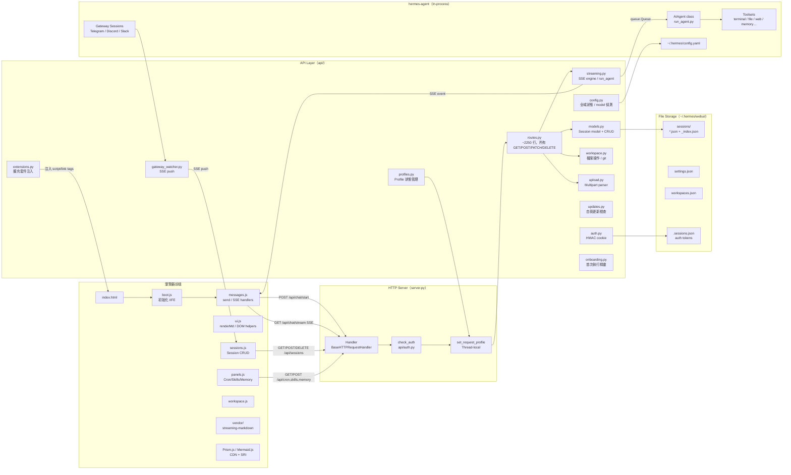
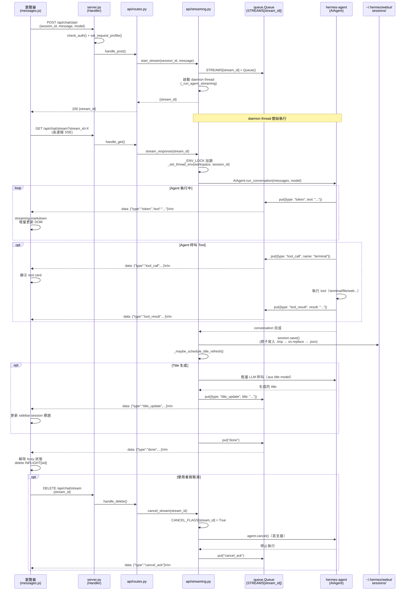

# Hermes Web UI — 系統架構文件

> 版本：v0.50.245（April 30, 2026）  
> 撰寫日期：2026-05-05

---

## 1. 高層架構概述

Hermes Web UI 是以「**無框架 Python Monolith**」為核心的 Web 應用程式，為 Hermes Agent（NousResearch 出品的自主式 AI agent）提供與 CLI 完全對等的瀏覽器端介面。

架構特色：
- **無 Web Framework**：HTTP 層直接使用 Python stdlib 的 `ThreadingHTTPServer`（`http.server`），沒有 Django、Flask、FastAPI。
- **無前端 Build Step**：前端使用 Vanilla JavaScript（ES2017+），直接以 `<script>` tag 載入，沒有 React、Vue、bundler 或 transpiler。
- **In-process Agent**：AI agent（`hermes-agent`）透過 `sys.path` 注入後直接 import，在同一個 Python 程序中執行。
- **SSE 串流**（非 WebSocket）：所有 AI 回應透過 Server-Sent Events（SSE）單向推送至瀏覽器。
- **File-based Session 儲存**：每個 session 存為一個 JSON 檔案，搭配原子寫入與 LRU in-memory cache。

---

## 2. 整體架構圖



---

## 3. 元件清單

| 元件 | 職責 | 關鍵檔案 | 上游依賴 | 下游依賴 |
|------|------|----------|----------|----------|
| **server.py** | HTTP 伺服器入口、middleware chain、TLS、FD limit | `server.py`（~154 行） | Python stdlib | `api/routes.py`, `api/auth.py`, `api/profiles.py` |
| **routes.py** | 所有 REST endpoint handler | `api/routes.py`（~2250 行） | `server.py` | `streaming.py`, `models.py`, `workspace.py`, `upload.py` |
| **streaming.py** | SSE engine、agent thread 管理、cancel 機制、title 生成 | `api/streaming.py`（~660 行） | `routes.py`, `config.py` | `hermes-agent/run_agent.AIAgent` |
| **models.py** | Session CRUD、原子寫入、LRU cache、CLI bridge | `api/models.py`（~377 行） | `config.py` | `~/.hermes/webui/sessions/` |
| **config.py** | 全域狀態初始化、agent 路徑偵測、model 清單快取 | `api/config.py`（~1110 行） | import time 執行 | 幾乎所有 `api/` 模組 |
| **auth.py** | 可選密碼認證、HMAC cookie、rate limiting | `api/auth.py`（~201 行） | `server.py` | `~/.hermes/webui/.sessions.json` |
| **profiles.py** | Profile 切換、thread-local profile context | `api/profiles.py`（~411 行） | `server.py`, `config.py` | hermes-agent profile dirs |
| **workspace.py** | 檔案操作、git 偵測、workspace 清單 | `api/workspace.py`（~288 行） | `routes.py` | 檔案系統 |
| **gateway_watcher.py** | 監視 gateway sessions、SSE push | `api/gateway_watcher.py` | `server.py`（`start_watcher()`） | 前端 `sessions.js` |
| **extensions.py** | WebUI 擴充套件 script/stylesheet 注入 | `api/extensions.py` | `routes.py`（`index.html` 回傳時） | 前端 Extension JS/CSS |
| **messages.js** | `send()` 函式、SSE EventSource 處理、INFLIGHT 狀態 | `static/messages.js`（~655 行） | `ui.js`, `sessions.js` | `POST /api/chat/start`, `GET /api/chat/stream` |
| **ui.js** | DOM helpers、`renderMd()`、全域狀態 `S`、tool cards | `static/ui.js`（~1740 行） | 所有前端模組共用 | Prism.js, Mermaid.js, streaming-markdown |
| **sessions.js** | Session CRUD、search、sidebar 渲染 | `static/sessions.js`（~800 行） | `ui.js` | `GET/POST/DELETE /api/sessions` |
| **panels.js** | Cron / Skills / Memory / Profiles / Settings 面板 | `static/panels.js`（~1438 行） | `ui.js` | 各 `/api/` 端點 |
| **boot.js** | 行動導覽、voice input、啟動 IIFE | `static/boot.js`（~524 行） | 所有前端模組 | `loadSession()` |

---

## 4. 分層設計與 Module Boundary

```
┌─────────────────────────────────────────┐
│              瀏覽器前端                  │
│   Vanilla JS（無 framework/bundler）     │
│   boot.js → messages.js → ui.js        │
│            sessions.js panels.js        │
├─────────────────────────────────────────┤
│       HTTP Transport Layer              │
│   server.py（ThreadingHTTPServer）      │
│   Middleware：auth → profile → route   │
├─────────────────────────────────────────┤
│       API Business Logic Layer          │
│   api/routes.py（routing dispatcher）  │
│   api/streaming.py（agent executor）   │
│   api/models.py（session state）       │
│   api/config.py（global state）        │
│   其他 api/ 功能模組                    │
├─────────────────────────────────────────┤
│       Agent Integration Layer           │
│   hermes-agent（in-process import）    │
│   AIAgent.run_conversation()           │
├─────────────────────────────────────────┤
│       File System / Storage Layer       │
│   ~/.hermes/webui/sessions/*.json      │
│   ~/.hermes/config.yaml                │
│   ~/.hermes/<profile>/                 │
└─────────────────────────────────────────┘
```

**Module Boundary 原則**：
- 前端只透過 HTTP REST + SSE 與後端通訊，無直接 WebSocket。
- `routes.py` 是所有 HTTP endpoint 的唯一入口，`server.py` 不包含業務邏輯。
- `config.py` 在 import time 初始化全域狀態（`SESSIONS`、`STREAMS`、`CANCEL_FLAGS`），其他模組從此取得共用狀態。
- `hermes-agent` 透過 `sys.path.insert()` 注入，對 WebUI 其他模組完全透明。

---

## 5. 通訊模式

| 模式 | 使用場景 | 實作位置 |
|------|----------|----------|
| **Sync REST（GET/POST/PATCH/DELETE）** | Session CRUD、設定讀寫、workspace 操作、profile 切換 | `api/routes.py` |
| **Async SSE（Server-Sent Events）** | AI 回應 token 串流、心跳（heartbeat）、title update、cancel 確認 | `api/streaming.py:stream_response()` |
| **SSE Push（gateway watcher）** | Gateway session（Telegram/Discord/Slack）即時同步到 sidebar | `api/gateway_watcher.py` |
| **Multipart Upload** | 檔案上傳（附件、圖片） | `api/upload.py` |
| **Thread-local（process 內部）** | Per-request profile context、env 備份 | `api/profiles.py`, `api/streaming.py:_set_thread_env()` |
| **queue.Queue（thread 間）** | agent thread → SSE response thread | `api/streaming.py`（`STREAMS` dict） |

### SSE 串流協定

SSE 端點使用兩步驟設計：

1. `POST /api/chat/start`：建立 `queue.Queue`，啟動 daemon thread 執行 agent，立即回傳 `{stream_id}`。
2. `GET /api/chat/stream?stream_id=X`：長連線，`queue.get(timeout=5)` loop，timeout 送出 heartbeat（`: heartbeat\n\n`），收到 `done` 或 `error` 才關閉。

SSE 事件類型：

| 事件 | 資料 | 說明 |
|------|------|------|
| `token` | `{text}` | AI 回應的 markdown token（逐字） |
| `tool_call` | `{name, args}` | Agent 呼叫 tool |
| `tool_result` | `{result}` | Tool 執行結果 |
| `title_update` | `{title}` | LLM 生成 session title 後推送 |
| `done` | `{usage}` | Agent 完成，含 token usage |
| `error` | `{message}` | 錯誤訊息 |
| `cancel_ack` | - | 取消確認 |
| `pending_user_message` | `{session}` | Gateway session 新訊息 push |

---

## 6. 關鍵設計決策與 Trade-off

### ADR-001：ThreadingHTTPServer（無 async framework）

**決策**：使用 Python stdlib `http.server.ThreadingHTTPServer`，不引入 asyncio、ASGI 或任何 Web framework。

**理由**：
- 依賴最小化：`requirements.txt` 只有 `pyyaml>=6.0`，無需安裝 FastAPI/uvicorn 等。
- hermes-agent 本身是同步 blocking I/O，用 asyncio 反而需要 `run_in_executor` 包裝。
- 每個請求一個 thread，簡化偵錯與 thread-local profile context 設計。

**Trade-off**：
- 每個並發請求消耗一個 OS thread（SSE 長連線尤其佔用 thread）。
- `os.environ` 是 process-global，多個 session 並發時環境變數可能互相干擾（`_ENV_LOCK` 是 interim fix，非完整解方）。

### ADR-002：無前端 Build Step

**決策**：前端使用 Vanilla JS，直接從磁碟服務靜態檔案，無 webpack/vite/bundler。

**理由**：
- 開發、部署、debug 極度簡單：修改 `.js` 後直接重新整理瀏覽器。
- 無需 Node.js 環境或 build 步驟。
- 符合 hermes-agent 專案風格（最小依賴）。

**Trade-off**：
- 無 TypeScript 型別安全。
- 全域狀態（`const S = {...}`）需要手動管理。
- 大型 JS 檔案（`ui.js` ~1740 行、`panels.js` ~1438 行）難以模組化。

### ADR-003：SSE over WebSocket

**決策**：所有串流使用 Server-Sent Events（SSE），不使用 WebSocket。

**理由**：
- AI 回應天生是單向（server → client），不需要雙向通道。
- 瀏覽器 `EventSource` API 原生支援，無需額外 library。
- 不需要 upgrade handshake，穿透 proxy/CDN 更容易。
- 自動 reconnect 機制內建於 `EventSource`。

**Trade-off**：
- 不支援 client → server streaming（如未來的 voice input streaming）。
- 每個 SSE 連線佔用一個 server thread（ThreadingHTTPServer 限制）。

### ADR-004：In-process Agent（vs. 獨立微服務）

**決策**：hermes-agent 透過 `sys.path.insert()` 直接 import，在同一 Python 程序中呼叫 `AIAgent.run_conversation()`。

**理由**：
- 部署簡單：一個 Docker container 即可，不需要 service mesh。
- 無網路序列化開銷。
- 直接存取 agent 的所有 Python class（Profile、Memory、Skills）。

**Trade-off**：
- agent crash 會拉倒整個 WebUI。
- 多個 Docker compose 檔（`two-container`、`three-container`）示範了分離部署模式，但需要額外設定。

### ADR-005：Module-level Approval State

**決策**：`CANCEL_FLAGS`、`STREAMS`、`AGENT_INSTANCES` 等串流狀態作為 module-level global dict 存在 `api/config.py`。

**理由**：
- ThreadingHTTPServer 中，每個請求 thread 都 import 相同模組，共用 module-level 狀態不需要額外的 IPC。
- 簡單可靠，無需 Redis 或共享記憶體。

**Trade-off**：
- 程序重啟後 in-flight 狀態遺失。
- 不支援多 worker 水平擴展（單一 Python 程序設計）。

### ADR-006：No Auth by Default

**決策**：預設不啟用認證，僅在設定 `HERMES_WEBUI_PASSWORD` 時才啟用 HMAC cookie auth。

**理由**：
- 本地使用（`localhost:8787`）不需要認證。
- 降低首次使用門檻。
- 安全文件（`README.md`）明確說明暴露至外部網路前需啟用密碼。

**Trade-off**：
- 使用者若未設定密碼直接暴露至公網，任何人都能存取。
- 無法做精細 RBAC 權限控制（非設計目標）。

---

## 7. 核心流程 Sequence Diagram

### 使用者傳訊息 → AI 回應完整流程



---

## 8. 擴充點（Extension Points）

| 擴充點 | 機制 | 難度 |
|--------|------|------|
| **WebUI Extensions** | `HERMES_WEBUI_EXTENSION_DIR` 注入 JS/CSS | 低（純 JS/CSS） |
| **自訂主題** | `:root[data-theme="name"]` CSS custom properties | 低（純 CSS） |
| **新增 API endpoint** | `api/routes.py` 新增 `elif` 分支 | 低 |
| **新增 sidebar panel** | `index.html` + `panels.js` + `boot.js` + `style.css` | 中 |
| **新增 slash command** | `static/commands.js` commands array | 低 |
| **新增 AI provider** | `api/onboarding.py` 新增 provider 偵測 | 中 |
| **新增 toolset** | `~/.hermes/config.yaml` 的 `platform_toolsets.cli` | 低（設定） |
| **新增 Profile** | Settings 面板 UI 或 `create_profile_api()` | 低 |

---

## 9. 測試架構

- 測試框架：`pytest`
- 規模：3309 tests，366 test files（截至 v0.50.245）
- 測試伺服器：`tests/conftest.py` 啟動隔離的測試伺服器（port 8788）
- 測試命名慣例：`test_<feature>.py`，每個 sprint/feature 一個檔案
- CI/CD：GitHub Actions，multi-arch Docker build + GitHub Release on tag

---

## 10. 部署模式

| 模式 | 說明 | 對應設定 |
|------|------|----------|
| **本地開發** | `./start.sh`，自動偵測 hermes-agent、開瀏覽器 | `bootstrap.py` |
| **Daemon** | `./ctl.sh start`，背景執行，log 至 `~/.hermes/webui.log` | `ctl.sh` |
| **單容器 Docker** | agent + WebUI 同容器 | `docker-compose.yml` |
| **雙容器 Docker** | agent 與 WebUI 分容器 | `docker-compose.two-container.yml` |
| **三容器 Docker** | agent + dashboard + WebUI | `docker-compose.three-container.yml` |
| **TLS** | 設定 `HERMES_WEBUI_TLS_CERT` + `HERMES_WEBUI_TLS_KEY` | `server.py:main()` |
