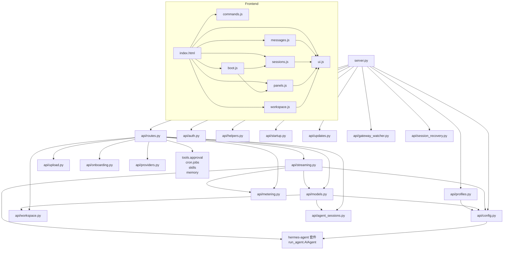

# Hermes Web UI — 程式碼地圖

## 「我想改 X 要看哪裡？」速查

| 我想要... | 看這裡 | 關鍵檔案 |
|-----------|--------|---------|
| 新增 API endpoint | `api/routes.py` | `handle_get()` 或 `handle_post()` 中的 `if/elif` 鏈 |
| 修改 AI 串流邏輯 | `api/streaming.py` | `_run_agent_streaming()` |
| 修改 Session 資料結構 | `api/models.py` | `class Session` |
| 新增主題 | `static/style.css` | `:root[data-theme="name"]` 區塊 |
| 修改 sidebar（sessions） | `static/sessions.js` | `renderSessionList()` |
| 修改 chat UI | `static/messages.js` | `send()`、SSE handlers |
| 修改右側面板（workspace） | `static/workspace.js` | `loadDir()`、`openFile()` |
| 修改 Tasks/Skills/Memory/Profiles 面板 | `static/panels.js` | `load*()` 函式 |
| 修改 Logs 面板（log 檔案檢視器） | `static/panels.js` + `api/routes.py` | `panelLogs`、`_handle_logs()`、`GET /api/logs` |
| 修改 LLM Wiki Status 顯示 | `static/panels.js` + `api/routes.py` | `wiki-status-card`、`_handle_llm_wiki_status()` |
| 修改 slash commands | `static/commands.js` | commands registry array |
| 修改全域 DOM helpers | `static/ui.js` | `renderMd()`、`setBusy()`、`showToast()` |
| 修改行動導覽 / voice input | `static/boot.js` | boot IIFE |
| 修改認證邏輯 | `api/auth.py` | `check_auth()`、`handle_login()` |
| 修改設定讀寫 | `api/config.py` | `load_settings()`、`save_settings()` |
| 修改 workspace 檔案操作 | `api/workspace.py` | `list_dir()`、`read_file_content()` |
| 修改 profile 系統 | `api/profiles.py` | `switch_profile()`、`create_profile_api()` |
| 修改 cron 相關 API | `api/routes.py` | `/api/crons*` 區段 |
| 修改 onboarding 精靈 | `api/onboarding.py` + `static/onboarding.js` | - |
| 修改 Docker 設定 | `Dockerfile` + `docker-compose*.yml` | - |
| 新增 WebUI extension | `docs/EXTENSIONS.md` | `HERMES_WEBUI_EXTENSION_DIR` |
| 修改 i18n 字串 | `static/i18n.js` | 語言 key-value 對照表 |
| 新增測試 | `tests/` | 新建 `test_<feature>.py` |
| 修改測試基礎設施 | `tests/conftest.py` | 隔離 server setup |
| 修改啟動流程 | `bootstrap.py` + `server.py:main()` | - |
| 調整 security headers | `api/helpers.py` | `set_security_headers()` |

---

## Annotated Directory Tree

```
hermes-webui/
│
├── server.py              ← 入口點：HTTP server + 路由分發
│                             薄 shell（~154 行），委派所有業務邏輯到 api/
│
├── bootstrap.py           ← 一鍵啟動：自動安裝、health wait、開瀏覽器
├── start.sh               ← bootstrap.py 的 shell wrapper
├── ctl.sh                 ← Daemon 管理（start/stop/status/logs/restart）
│
├── requirements.txt       ← pyyaml>=6.0（唯一直接 Python 依賴）
├── Dockerfile             ← python:3.12-slim 容器映像
├── docker-compose.yml     ← 單容器（最常用）
├── docker-compose.two-container.yml   ← Agent + WebUI 分容器
├── docker-compose.three-container.yml ← Agent + Dashboard + WebUI
├── docker_init.bash       ← Docker 初始化（UID/GID 設定）
│
├── api/                   ← 後端業務邏輯（Python 套件）
│   ├── __init__.py
│   ├── config.py          ← 設定、全域狀態、agent 目錄偵測
│   │                         SESSIONS、STREAMS、CANCEL_FLAGS 都在這裡
│   ├── routes.py          ← 所有 HTTP route handlers（最大的單一檔案）
│   │                         handle_get() / handle_post() / handle_patch() / handle_delete()
│   ├── streaming.py       ← SSE 串流引擎 + agent run thread
│   │                         _run_agent_streaming()：核心執行路徑
│   ├── models.py          ← Session model、CRUD、CLI bridge
│   │                         class Session、get_session()、all_sessions()
│   ├── auth.py            ← 可選密碼認證（HMAC cookie）
│   ├── helpers.py         ← HTTP 工具（j()、bad()、require()）
│   ├── profiles.py        ← Profile 系統、hermes_cli wrapper
│   ├── onboarding.py      ← 首次執行精靈、OAuth provider 偵測
│   ├── workspace.py       ← 檔案操作（list_dir、read_file_content、safe_resolve）
│   ├── upload.py          ← Multipart parser（手工實作，取代棄用的 cgi.FieldStorage）
│   ├── updates.py         ← 自我更新檢查（GitHub releases API）
│   ├── providers.py       ← Provider 管理 API
│   ├── agent_sessions.py  ← CLI session bridge（讀取 hermes-agent SQLite）
│   ├── gateway_watcher.py ← Gateway session 即時監控（Telegram/Discord/Slack）
│   ├── metering.py        ← Token/cost metering
│   ├── state_sync.py      ← /insights sync（message_count → state.db）
│   ├── extensions.py      ← WebUI extension 注入
│   ├── session_recovery.py← 啟動時從 .bak 還原 sessions（#1558）
│   ├── session_ops.py     ← Session 操作輔助
│   ├── background.py      ← 背景任務管理
│   ├── terminal.py        ← 終端機介面後端
│   ├── clarify.py         ← 釐清問題的 UI 機制
│   ├── commands.py        ← Server-side slash command 處理
│   ├── kanban_bridge.py   ← Kanban 整合
│   ├── dashboard_probe.py ← Dashboard status probe
│   ├── rollback.py        ← 版本回滾
│   ├── oauth.py           ← OAuth 支援
│   └── startup.py         ← 啟動輔助（auto_install_agent_deps）
│
├── static/                ← 前端靜態檔案（直接從磁碟服務，無 build）
│   ├── index.html         ← HTML 模板（唯一的 HTML 檔）
│   ├── style.css          ← 全部 CSS（主題、mobile responsive、components）
│   ├── ui.js              ← 全域 DOM helpers、renderMd、tool cards
│   │                         最大的前端模組，包含全域狀態 S 和 INFLIGHT
│   ├── sessions.js        ← Session CRUD、sidebar 渲染、search
│   ├── messages.js        ← send()、SSE event handlers、approval
│   ├── panels.js          ← Tasks/Skills/Memory/Profiles/Settings 面板
│   ├── workspace.js       ← 右側 workspace 面板（file tree、preview）
│   ├── commands.js        ← Slash command autocomplete
│   ├── boot.js            ← 行動導覽、voice input、boot IIFE
│   ├── i18n.js            ← 多語言字串（en/de/es/zh/zh-Hant）
│   ├── icons.js           ← SVG icon 定義
│   ├── onboarding.js      ← 首次執行精靈前端
│   ├── login.js           ← 登入頁面邏輯
│   ├── terminal.js        ← 終端機介面前端
│   ├── sw.js              ← Service Worker（PWA）
│   ├── manifest.json      ← PWA manifest
│   ├── favicon*.{ico,svg,png}
│   └── vendor/
│       └── streaming-markdown.js  ← vendored（0.2.15），無 CDN
│
├── tests/                 ← 測試套件（366 個檔案，3309+ tests）
│   ├── conftest.py        ← 隔離測試 server（port 8788，獨立 HERMES_HOME）
│   ├── _pytest_port.py    ← Port 分配輔助
│   └── test_*.py          ← 每個 feature 一個測試檔
│
├── docs/
│   ├── docker.md          ← Docker 完整指南
│   ├── EXTENSIONS.md      ← WebUI extension 開發指南
│   ├── ISSUES.md          ← 已知問題
│   ├── wsl-autostart.md   ← WSL 自動啟動
│   ├── supervisor.md      ← Supervisor 整合
│   └── images/            ← UI 截圖
│
├── scripts/
│   ├── windows/           ← Windows 腳本
│   └── wsl/               ← WSL 腳本
│
└── .github/workflows/     ← CI（multi-arch Docker build + GitHub Release）
```

---

## 模組依賴關係圖



---

## 關鍵全域狀態（`api/config.py`）

| 變數 | 型別 | 說明 |
|------|------|------|
| `SESSIONS` | `OrderedDict` | In-memory session cache（最多 100 個，LRU） |
| `LOCK` | `threading.Lock` | 保護 SESSIONS 的讀寫 |
| `STREAMS` | `dict` | `stream_id → queue.Queue`，SSE 串流 |
| `STREAMS_LOCK` | `threading.Lock` | 保護 STREAMS |
| `CANCEL_FLAGS` | `dict` | `stream_id → bool`，agent cancel |
| `AGENT_INSTANCES` | `dict` | `stream_id → AIAgent`，用於 cancel |
| `SESSION_AGENT_LOCKS` | `dict` | `session_id → Lock`，per-session agent 串列化 |
| `_ENV_LOCK` | `threading.Lock` | 全域 os.environ 寫入串列化（`api/streaming.py`） |

---

## 關鍵前端全域狀態（`static/ui.js`）

| 變數 | 型別 | 說明 |
|------|------|------|
| `S` | `object` | 全域 UI 狀態（session, messages, entries, busy, pendingFiles） |
| `INFLIGHT` | `object` | In-flight 請求狀態（session switch 保護） |

---

## 檔案路徑速查

| 類型 | 位置 | 說明 |
|------|------|------|
| Session 資料 | `~/.hermes/webui/sessions/{sid}.json` | 每個對話的完整資料 |
| Session 索引 | `~/.hermes/webui/sessions/_index.json` | O(1) 讀取的摘要索引 |
| 使用者設定 | `~/.hermes/webui/settings.json` | theme、send_key、password_hash 等 |
| Workspace 清單 | `~/.hermes/webui/workspaces.json` | 已登錄的工作目錄 |
| 專案群組 | `~/.hermes/webui/projects.json` | Session 的命名群組 |
| Auth tokens | `~/.hermes/webui/.sessions.json` | HMAC session tokens（0600） |
| Signing key | `~/.hermes/webui/.signing_key` | HMAC signing key（0600） |
| Server log | `~/.hermes/webui.log` | Daemon 模式的 stdout/stderr |
| PID 檔案 | `~/.hermes/webui.pid` | Daemon 模式的 PID |
| Agent config | `~/.hermes/config.yaml` | hermes-agent 主設定 |
| Agent memory | `~/.hermes/memories/MEMORY.md` | Agent 跨 session 記憶 |
| Agent skills | `~/.hermes/skills/` | Agent 自動生成的 skills |
