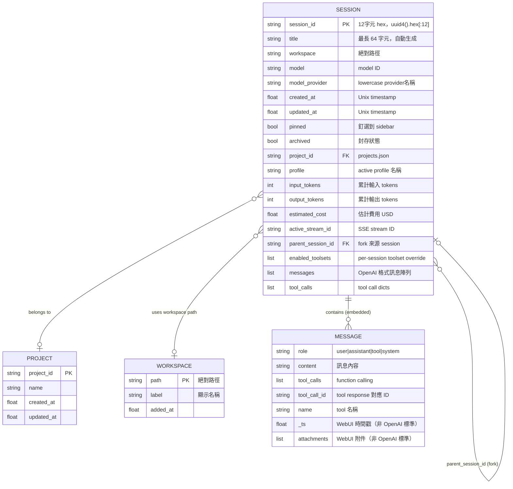

# DATA_MODEL.md — Hermes Web UI 資料模型文件

> 版本：v0.50.245（April 30, 2026）  
> 撰寫日期：2026-05-05

---

## 目錄

1. [資料儲存概覽](#1-資料儲存概覽)
2. [核心 Entity 清單](#2-核心-entity-清單)
3. [Session Entity 完整欄位說明](#3-session-entity-完整欄位說明)
4. [各資料檔案的路徑與格式](#4-各資料檔案的路徑與格式)
5. [ER Diagram](#5-er-diagram)
6. [資料生命週期：Session](#6-資料生命週期session)
7. [原子寫入模式](#7-原子寫入模式)
8. [前端全域狀態（S object）](#8-前端全域狀態s-object)
9. [INFLIGHT 機制](#9-inflight-機制)
10. [LRU 記憶體快取](#10-lru-記憶體快取)

---

## 1. 資料儲存概覽

Hermes Web UI **不使用 SQL database**。所有持久化資料以 **JSON 檔案**儲存在磁碟上，預設路徑為：

```
~/.hermes/webui/          ← STATE_DIR（可透過 HERMES_WEBUI_STATE_DIR 環境變數覆寫）
├── sessions/
│   ├── {session_id}.json     # 每個 Session 一個 JSON 檔
│   ├── _index.json           # Session 索引（compact 摘要，O(1) 讀取）
│   ├── *.tmp.<pid>.<tid>     # 原子寫入的中間檔（寫入後立即 replace）
│   └── *.bak                 # 備份檔（session recovery 用，#1558）
├── workspaces.json           # 已登錄的 workspace 清單
├── settings.json             # 使用者設定
├── projects.json             # Session 群組（Project）
├── last_workspace.txt        # 最近使用的 workspace 路徑
└── .sessions.json            # Auth session tokens（HMAC）
```

路徑定義位於 `api/config.py:41-52`：

```python
STATE_DIR        = ~/.hermes/webui         # api/config.py:41
SESSION_DIR      = STATE_DIR / "sessions"  # api/config.py:47
SESSION_INDEX_FILE = SESSION_DIR / "_index.json"  # api/config.py:49
WORKSPACES_FILE  = STATE_DIR / "workspaces.json"  # api/config.py:48
SETTINGS_FILE    = STATE_DIR / "settings.json"    # api/config.py:50
PROJECTS_FILE    = STATE_DIR / "projects.json"    # api/config.py:52
```

---

## 2. 核心 Entity 清單

| Entity | 對應檔案 | 說明 |
|--------|---------|------|
| **Session** | `sessions/{sid}.json` | 一次對話，含完整訊息陣列（最核心的 entity） |
| **Session Index** | `sessions/_index.json` | 所有 Session 的 compact 摘要，用於 sidebar 列表 |
| **Project** | `projects.json` | Session 群組（資料夾概念） |
| **Workspace** | `workspaces.json` | Agent 工作目錄的登錄清單 |
| **Settings** | `settings.json` | 使用者偏好設定 |
| **Auth Session** | `.sessions.json` | 已驗證的 browser session tokens |
| **Message** | 嵌入在 Session JSON 中 | OpenAI 格式訊息（role/content/tool_calls） |

### 2.1 Message 格式（OpenAI 相容）

`messages` 陣列中的每筆訊息遵循 OpenAI Chat Completion API 格式：

| 欄位 | 型別 | 說明 |
|------|------|------|
| `role` | `str` | `"user"` \| `"assistant"` \| `"tool"` \| `"system"` |
| `content` | `str \| list` | 訊息內容；可為文字或多模態 content parts |
| `tool_calls` | `list \| null` | Assistant 發出的 tool call 請求（function calling） |
| `tool_call_id` | `str \| null` | Tool response 對應的 call ID |
| `name` | `str \| null` | Tool 名稱（role=tool 時使用） |
| `refusal` | `str \| null` | Model 拒絕回應的原因 |
| `_ts` | `float` | WebUI 附加的時間戳（非 OpenAI 標準欄位） |
| `attachments` | `list \| null` | WebUI 附加的檔案附件清單（非 OpenAI 標準欄位） |

> 傳送給 Agent 前，`_sanitize_messages_for_api()` 會過濾掉 `_ts`、`attachments` 等 webui-only 欄位，只保留 OpenAI 標準欄位。（`api/routes.py`）

### 2.2 Project 格式（`projects.json`）

陣列，每筆含 `project_id`（PK）、`name`、`created_at`、`updated_at`。

### 2.3 Workspace 格式（`workspaces.json`）

陣列，每筆含 `path`（絕對路徑）、`label`（顯示名稱）、`added_at`（Unix timestamp）。

---

## 3. Session Entity 完整欄位說明

定義於 `api/models.py:309-363`，以下為完整欄位表：

### 3.1 識別與基本資訊

| 欄位 | 型別 | 預設值 | 說明 |
|------|------|--------|------|
| `session_id` | `str` | `uuid4().hex[:12]` | 12 字元 hex 字串，唯一識別碼（如 `"a1b2c3d4e5f6"`） |
| `title` | `str` | `"Untitled"` | Session 標題，限 64 字元；自動從第一條訊息生成 |
| `created_at` | `float` | `time.time()` | 建立時的 Unix timestamp |
| `updated_at` | `float` | `time.time()` | 最後儲存時的 Unix timestamp；每次 `save()` 更新 |
| `profile` | `str \| None` | `None` | 建立時的 active profile 名稱 |

### 3.2 Agent 與工作環境

| 欄位 | 型別 | 預設值 | 說明 |
|------|------|--------|------|
| `workspace` | `str` | `DEFAULT_WORKSPACE` | Agent 工作目錄的絕對路徑（`Path.expanduser().resolve()` 後） |
| `model` | `str` | `DEFAULT_MODEL` | 使用的 model ID（如 `"anthropic/claude-sonnet-4.6"`） |
| `model_provider` | `str \| None` | `None` | Provider 名稱（lowercase，如 `"anthropic"`） |
| `personality` | `str \| None` | `None` | 自訂 system prompt / personality 設定 |
| `enabled_toolsets` | `list[str] \| None` | `None` | Per-session toolset 覆寫；`None` 代表使用全域設定 |

### 3.3 訊息資料

| 欄位 | 型別 | 預設值 | 說明 |
|------|------|--------|------|
| `messages` | `list` | `[]` | OpenAI 格式訊息陣列（完整對話歷史） |
| `tool_calls` | `list` | `[]` | Tool call dicts（Sprint 10 追加） |
| `context_messages` | `list` | `[]` | Context injection 用的額外訊息 |

### 3.4 UI 狀態欄位

| 欄位 | 型別 | 預設值 | 說明 |
|------|------|--------|------|
| `pinned` | `bool` | `False` | 是否釘選到 sidebar 頂部 |
| `archived` | `bool` | `False` | 是否封存（隱藏但不刪除） |
| `project_id` | `str \| None` | `None` | 所屬 Project 的 FK（對應 `projects.json`） |

### 3.5 串流與 Pending 狀態

| 欄位 | 型別 | 預設值 | 說明 |
|------|------|--------|------|
| `active_stream_id` | `str \| None` | `None` | 當前 SSE stream 的 ID；`None` 代表閒置 |
| `pending_user_message` | `str \| None` | `None` | 排隊中尚未送出的使用者訊息 |
| `pending_attachments` | `list` | `[]` | 排隊中的附件清單 |
| `pending_started_at` | `float \| None` | `None` | Pending 訊息的開始時間 |

### 3.6 Token 計量

| 欄位 | 型別 | 預設值 | 說明 |
|------|------|--------|------|
| `input_tokens` | `int` | `0` | 累計輸入 token 數 |
| `output_tokens` | `int` | `0` | 累計輸出 token 數 |
| `estimated_cost` | `float \| None` | `None` | 估計費用（USD） |
| `last_prompt_tokens` | `int \| None` | `None` | 最後一次請求的 prompt token 數 |

### 3.7 Context Compression 欄位

| 欄位 | 型別 | 說明 |
|------|------|------|
| `compression_anchor_visible_idx` | `int \| None` | Context 壓縮的可見 anchor index |
| `compression_anchor_message_key` | `str \| None` | Context 壓縮的 anchor message key |
| `context_length` | `int \| None` | Model 的 context window 長度 |
| `threshold_tokens` | `int \| None` | 觸發壓縮的 token 門檻 |

### 3.8 Session Lineage（分支）

| 欄位 | 型別 | 說明 |
|------|------|------|
| `parent_session_id` | `str \| None` | 分支（fork）的來源 Session ID（#1342） |

### 3.9 CLI Bridge 欄位

`is_cli_session`（bool）、`source_tag`、`raw_source`、`session_source`、`source_label`：用於標記從 hermes-agent CLI 匯入的 session 及其來源資訊（`api/models.py:358-362`）。

### 3.10 compact() 輸出（`_index.json` 及 API 回應）

`Session.compact()`（`api/models.py:527`）產生精簡 dict，用於 `_index.json` 及 sidebar API。包含所有基本欄位，加上 runtime 衍生欄位：`message_count`（訊息數）、`last_message_at`（最後訊息時間戳）、`has_pending_user_message`（boolean）、`is_streaming`（runtime only，不寫入磁碟）。

---

## 4. 各資料檔案的路徑與格式

### 4.1 `sessions/{session_id}.json`

完整 Session JSON，欄位順序由 `METADATA_FIELDS`（`api/models.py:393-404`）控制：元資料欄位在前，`messages` 和 `tool_calls` 陣列在後。這個設計讓 `load_metadata_only()` 可以在不解析巨型 `messages` 陣列的情況下讀取元資料。

```json
{
  "session_id": "a1b2c3d4e5f6",
  "title": "Fix memory leak in streaming",
  "workspace": "/home/user/my-project",
  "model": "anthropic/claude-sonnet-4.6",
  "model_provider": "anthropic",
  "created_at": 1714500000.0,
  "updated_at": 1714500123.0,
  "pinned": false,
  "archived": false,
  "project_id": null,
  "profile": "default",
  "input_tokens": 1234,
  "output_tokens": 567,
  "estimated_cost": 0.0023,
  "active_stream_id": null,
  "enabled_toolsets": null,
  "messages": [
    {"role": "user", "content": "Fix the memory leak", "_ts": 1714500000.0},
    {"role": "assistant", "content": "I'll look into that...", "_ts": 1714500010.0}
  ],
  "tool_calls": []
}
```

### 4.2 `sessions/_index.json`

Session compact 摘要清單，依 `updated_at` 降冪排列。每筆包含 `Session.compact()` 的輸出欄位（見第 3.10 節），不含完整 `messages` 陣列。`all_sessions()` 直接讀取此檔，O(1) 複雜度，不掃描 `sessions/` 目錄（Phase C 修復 TD6，`api/models.py:103`）。

### 4.3 `settings.json`

使用者偏好設定（`api/config.py:3106-3131`）：theme、skin、font_size、language、send_key、show_token_usage、simplified_tool_calling、sidebar_density、password_hash 等。

### 4.4 `projects.json` 與 `workspaces.json`

Session 群組（Project）與已登錄工作目錄的陣列格式 JSON。

### 4.5 `.sessions.json`

Auth session tokens，由 `api/auth.py` 管理，TTL 為 30 天（`SESSION_TTL = 86400 * 30`，`api/auth.py:17`）。

---

## 5. ER Diagram



---

## 6. 資料生命週期：Session

```mermaid
flowchart TD
    A([使用者首次送出訊息]) --> B{S.session 存在?}
    B -- 否 --> C[POST /api/session/new\n建立新 Session\nsession_id = uuid4.hex 12\ntitle = 'Untitled']
    B -- 是 --> D[使用現有 Session]
    C --> D

    D --> E[INFLIGHT 寫入\nINFLIGHT + localStorage]
    E --> F[POST /api/chat/start\n送出訊息]
    F --> G[_run_agent_streaming\n背景 daemon thread]
    G --> H[訊息累積\nmessages 陣列增長]
    H --> I[session.save\n原子寫入 .tmp → replace]
    I --> J{title 是 provisional?}
    J -- 是 --> K[背景 title 生成\n_maybe_schedule_title_refresh\nSSE: title_update 事件]
    J -- 否 --> L
    K --> L[SSE: done 事件\n前端更新 S.messages\ndelete INFLIGHT]

    L --> M{使用者操作}
    M -- 繼續對話 --> F
    M -- 釘選 --> N[PATCH /api/session\npinned=true\nsession.save]
    M -- 封存 --> O[PATCH /api/session\narchived=true\nsession.save\n從 sidebar 隱藏]
    M -- 刪除 --> P[DELETE /api/session\n刪除 .json 檔\n從 _index.json 移除]

    style C fill:#2d4a2d
    style K fill:#2d3a4a
    style P fill:#4a2d2d
```



### 生命週期說明

- **建立**：`POST /api/session/new`；`session_id = uuid4().hex[:12]`；初始 `title = "Untitled"`（`api/models.py:330`）
- **訊息累積**：每次 `agent.run_conversation()` 完成後更新 `session.messages`，呼叫 `session.save()` 原子寫入並同步 `_index.json`
- **Title 更新**：回應完成後 `_maybe_schedule_title_refresh()` 判斷是否啟動背景 title 生成，成功後透過 SSE `title_update` 事件即時推送前端
- **封存**（`archived=true`）：保留磁碟檔案，從 sidebar 主列表隱藏
- **釘選**（`pinned=true`）：固定在 sidebar 頂部
- **刪除**：實體刪除 `{sid}.json`，同步更新 `_index.json`

---

## 7. 原子寫入模式

Hermes Web UI 使用三段式原子寫入確保資料一致性，防止伺服器崩潰時資料損壞。

### 7.1 標準原子寫入（.tmp → os.replace）

定義於 `api/models.py:463-477` 和 `api/models.py:28-35`：

```python
# Session.save() — api/models.py:463-469
tmp = self.path.with_suffix(
    f'.tmp.{os.getpid()}.{threading.current_thread().ident}'
)
with open(tmp, 'w', encoding='utf-8') as f:
    f.write(json.dumps(meta, ensure_ascii=False))
    f.flush()
    os.fsync(f.fileno())
os.replace(tmp, self.path)  # POSIX 保證原子操作
```

- tmp 檔名嵌入 PID + TID，確保不同程序／執行緒不會互相覆寫
- `os.replace()` 在 POSIX 系統上是原子操作（即使伺服器在此瞬間崩潰，磁碟上只會有舊檔或新檔，不會有半寫入狀態）
- 同樣的模式也用於 `_write_session_index()`（`api/models.py:96`）

### 7.2 .bak 備份機制（#1558 修復）

在寫入新檔之前，如果現有檔案的訊息數比新版本多，先備份至 `.bak`：

```python
# api/models.py:416-453（簡化）
existing_msg_count = len(existing.get('messages') or [])
incoming_msg_count = len(self.messages or [])
if existing_msg_count > incoming_msg_count:
    bak_path = self.path.with_suffix('.json.bak')
    bak_tmp = bak_path.with_suffix(
        f'.bak.tmp.{os.getpid()}.{threading.current_thread().ident}'
    )
    shutil.copy2(self.path, bak_tmp)
    os.replace(bak_tmp, bak_path)  # 備份也是原子寫入
```

完整流程：
```
{sid}.json（現有，含更多 messages）
    ↓ shutil.copy2
{sid}.json.bak.tmp.<pid>.<tid>
    ↓ os.replace（原子）
{sid}.json.bak
                         {sid}.json.tmp.<pid>.<tid>（新內容）
                             ↓ os.replace（原子）
                         {sid}.json
```

- `.bak` 只在「新版本訊息數 < 舊版本」時寫入（防止 metadata-only load 後 save 覆蓋完整訊息）
- `api/session_recovery.py` 在啟動時自動還原 `.bak` 檔（若 `.json` 訊息數少於 `.bak`）

### 7.3 Stale tmp 清理

- 每次 `_write_session_index()` 全量重建時（通常為啟動），清理 mtime 超過 1 小時的 `*.tmp.*` 檔案（`api/models.py:45-63`）

---

## 8. 前端全域狀態（S object）

定義於 `static/ui.js:2`（INFLIGHT）及 sessions.js / messages.js：

```javascript
// static/ui.js — 前端唯一的全域狀態物件
const S = {
  session:      null,     // 當前 Session compact dict（來自 /api/session API）
  messages:     [],       // 當前 session 的完整訊息陣列
  entries:      [],       // workspace 目錄內容（檔案瀏覽器）
  busy:         false,    // agent 執行中旗標（true 時禁用 Send 按鈕）
  pendingFiles: []        // 待上傳的 File objects（拖曳或附加檔案）
}
```

### S.session 的結構

`S.session` 是 compact dict，對應 `Session.compact()` 的輸出（`api/models.py:527-578`），包含 `session_id`、`title`、`workspace`、`model`、`model_provider`、`message_count`、`pinned`、`archived`、`project_id`、`enabled_toolsets` 等欄位。

完整 `messages` 陣列存在 `S.messages`（分開存放，避免 compact dict 過大）。

### S.busy 與 Queue Drain

`setBusy(false)` 時（`static/ui.js:2369`），若有 queued 訊息（`_queueDrainSid`），自動觸發下一條訊息，實現 `busy_input_mode: "queue"` 的行為。

---

## 9. INFLIGHT 機制

INFLIGHT 解決的問題：**使用者在 AI 回應尚未完成時切換 session**，再切回來時能正確還原進行中的狀態。

### 9.1 資料結構

```javascript
// static/ui.js:2
const INFLIGHT = {}  // keyed by session_id，in-memory

// localStorage keys — api/ui.js:2967-2968
const INFLIGHT_KEY       = 'hermes-webui-inflight'        // 當前 in-flight sid + streamId
const INFLIGHT_STATE_KEY = 'hermes-webui-inflight-state'  // 各 session 的 messages 快照
```

### 9.2 生命週期

```
send() 開始
  │
  ├─ INFLIGHT[sid] = { messages: [...], uploaded: [...] }
  └─ localStorage.setItem(INFLIGHT_KEY, {sid, streamId, ts})
         localStorage.setItem(INFLIGHT_STATE_KEY, {[sid]: {messages}})

loadSession(sid) 被呼叫（切換回此 session）
  │
  ├─ 若 INFLIGHT[sid] 存在 → 顯示 in-flight 狀態（含 thinking indicator）
  └─ 若不存在 → 從 server 載入（GET /api/session）

SSE 'done' 事件
  │
  ├─ delete INFLIGHT[sid]
  └─ clearInflight(sid) → localStorage.removeItem(INFLIGHT_KEY)
                          更新 INFLIGHT_STATE_KEY（移除此 sid）
```

### 9.3 頁面重新整理後的恢復

啟動時讀取 `localStorage` 的 INFLIGHT 資料，重新取得 server 端狀態並嘗試重連 SSE stream（`static/messages.js:3220`）。

### 9.4 Session 切換並發保護

`static/data_flow.md` 記錄的 RULE-5：

```javascript
// send() 在所有 await 之前捕獲 activeSid
const activeSid = S.session.session_id

// SSE done 事件處理
if (S.session.session_id === activeSid) {
  // 正常路徑：更新 UI、setBusy(false)
} else {
  // 使用者已切換到其他 session
  // 只刷新 sidebar，不 setBusy(false)
}
```

---

## 10. LRU 記憶體快取

為避免每次請求都讀磁碟，Session 使用 LRU（Least Recently Used）記憶體快取：

```python
# api/config.py（由 models.py 引用）
SESSIONS = collections.OrderedDict()  # in-memory LRU cache
SESSIONS_MAX = 100                    # 最多快取 100 個 Session
LOCK = threading.RLock()              # 保護 SESSIONS dict

# get_session() — api/models.py
# 命中：SESSIONS.move_to_end(sid)（更新 LRU 順序）
# 未命中：從磁碟讀取 → 加入 SESSIONS
# 超過 100：SESSIONS.popitem(last=False)（淘汰最久未使用的）
```

`all_sessions()` 讀取 `_index.json` 而非掃描 `sessions/` 目錄，確保 sidebar 列表的載入是 O(1)，不受 session 數量影響（Phase C 修復 TD6，`api/models.py:85-190`）。

---

*本文件依據 `api/models.py`、`api/config.py`、`static/ui.js` 原始碼，以及 `.trace/_context/` 分析結果撰寫。*
