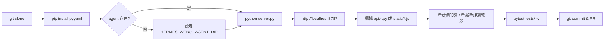
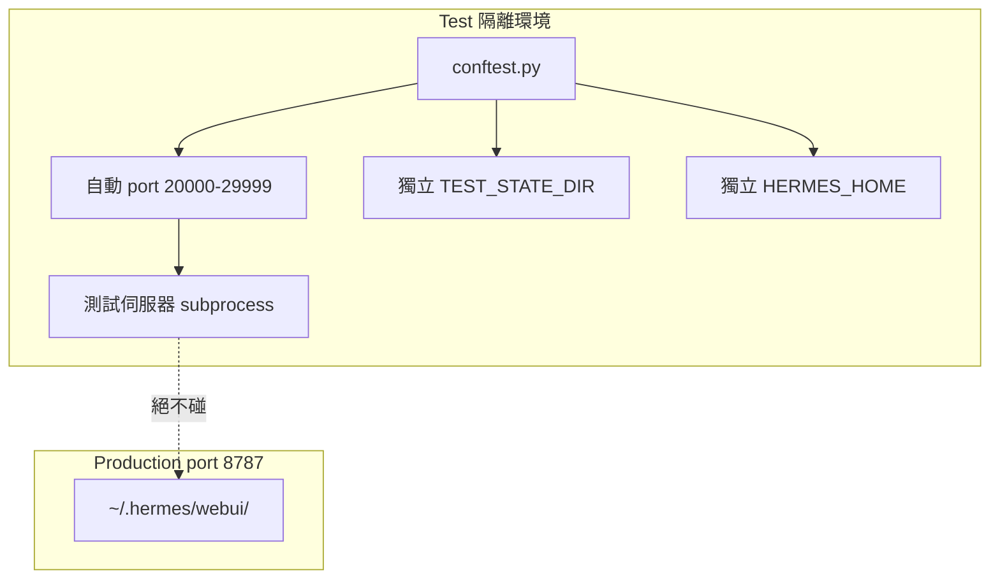

# Hermes Web UI — 開發者上手指南

> **版本**：基於 v0.50.245（2026-04-30）  
> **適用對象**：初次接觸此 repo 的貢獻者與維護者

---

## 1. Prerequisites 與環境建置

### 1.1 系統需求

| 需求 | 最低版本 | 說明 |
|------|---------|------|
| Python | 3.11 | CI 測試 3.11、3.12、3.13 三版本 |
| hermes-agent | 最新版 | NousResearch 出品，需獨立安裝 |
| Docker（選用） | 20.10+ | 容器化部署 |

**直接依賴只有一個**：`pyyaml>=6.0`（`requirements.txt`）。所有 AI/agent 依賴住在 hermes-agent 的 venv 中。

### 1.2 Step-by-step 環境建置

```bash
# Step 1：確認 hermes-agent 在路徑中（api/config.py 自動偵測）
ls ~/.hermes/hermes-agent/run_agent.py
# 或明確指定：export HERMES_WEBUI_AGENT_DIR=/path/to/hermes-agent

# Step 2：Clone 並安裝依賴
git clone https://github.com/nesquena/hermes-webui.git
cd hermes-webui
pip install -r requirements.txt

# Step 3：設定 hermes-agent config
mkdir -p ~/.hermes
cat > ~/.hermes/config.yaml << 'EOF'
model: anthropic/claude-sonnet-4.6
providers:
  - name: anthropic
    api_key: ${ANTHROPIC_API_KEY}
  - name: openai
    api_key: ${OPENAI_API_KEY}
EOF

# Step 4：（選用）複製環境變數範本
cp .env.example .env
```

### 1.3 主要環境變數

| 變數 | 預設值 | 說明 |
|------|--------|------|
| `HERMES_WEBUI_PORT` | `8787` | HTTP 端口（測試用自動分配 20000-29999） |
| `HERMES_WEBUI_STATE_DIR` | `~/.hermes/webui` | Session 儲存目錄 |
| `HERMES_WEBUI_DEFAULT_MODEL` | `openai/gpt-5.4-mini` | 預設模型 |
| `HERMES_WEBUI_PASSWORD` | 未設定 | 設定後啟用密碼認證 |
| `HERMES_WEBUI_AGENT_DIR` | 自動偵測 | hermes-agent 路徑 |

設定載入優先順序：環境變數 > `~/.hermes/config.yaml` > `~/.hermes/webui/settings.json` > `api/config.py` hardcoded defaults。

---

## 2. 本地開發 Workflow



### 2.1 啟動方式

```bash
python server.py          # 直接啟動（前景）
python bootstrap.py       # 一鍵啟動（自動偵測 agent、開瀏覽器）
bash ctl.sh start         # 背景 daemon 模式
bash ctl.sh logs          # 查看 log
bash ctl.sh stop          # 停止
```

### 2.2 無 Build Step 特點

這個專案**刻意不用** bundler、build step 或前端框架：

- 修改 `static/*.js` → 重新整理瀏覽器即可
- 修改 `api/*.py` → 只需重啟伺服器（`Ctrl+C` 再 `python server.py`）

### 2.3 關鍵檔案速查

| 檔案 | 作用 |
|------|------|
| `server.py` | 入口點、薄 routing shell（~154 行） |
| `api/routes.py` | 所有 GET/POST/PATCH/DELETE handlers（~2250+ 行） |
| `api/helpers.py` | HTTP 工具函式：`j()`, `t()`, `bad()`, `read_body()` |
| `api/models.py` | Session model + CRUD（~377 行） |
| `api/streaming.py` | SSE engine、run_agent（~660 行） |
| `static/panels.js` | Cron/Skills/Memory/Profiles/Settings panels（~1438 行） |
| `tests/conftest.py` | 測試基礎設施、隔離 port 與 state 目錄 |

---

## 3. 測試策略與執行方式

### 3.1 規模與隔離架構

**366 個**測試檔案、**3309+** tests，CI 跑 Python 3.11/3.12/3.13 三版本。



`tests/conftest.py` port 分配方式（第 36-40 行）：

```python
# 由 repo 路徑 MD5 hash 決定，確保不同 worktree 不衝突
def _auto_test_port(repo_root) -> int:
    import hashlib
    h = int(hashlib.md5(str(repo_root).encode()).hexdigest(), 16)
    return 20000 + (h % 10000)
```

### 3.2 執行測試

```bash
pytest tests/ -v --timeout=60          # 全部測試（推薦）
pytest tests/test_sprint1.py -v        # 單一測試檔
pytest tests/ --collect-only -q        # 僅收集（不執行）
```

### 3.3 在測試中呼叫 API

```python
# tests/conftest.py 的 server fixture 會啟動隔離伺服器
def test_health(server):
    import urllib.request, json
    with urllib.request.urlopen(f"{server}/health") as r:
        assert json.loads(r.read())["status"] == "ok"
```

---

## 4. 新增 API Endpoint 標準 Pattern

### 4.1 GET Endpoint（`api/routes.py:handle_get()`，第 2034 行附近）

```python
# 在 handle_get() 中，於 404 fallback 之前加入：
if parsed.path == "/api/my-feature":
    from urllib.parse import parse_qs
    sid = parse_qs(parsed.query).get("session_id", [None])[0]
    if not sid:
        return bad(handler, "session_id is required")
    try:
        session = get_session(sid)
    except KeyError:
        return bad(handler, "Session not found", status=404)
    return j(handler, {"data": session.some_field})
```

### 4.2 POST Endpoint（`api/routes.py:handle_post()`，第 2879 行附近）

**順序關鍵**：upload 在前，`read_body()` 在中，新 endpoint 在後：

```python
def handle_post(handler, parsed) -> bool:
    # ① upload 必須在 read_body() 之前（RULE-2）
    if parsed.path == "/api/upload":
        return handle_upload(handler)

    body = read_body(handler)  # ② 此行消費 body

    # ③ 你的 endpoint 在 read_body() 之後
    if parsed.path == "/api/my-feature/create":
        try:
            require(body, "name", "value")  # api/helpers.py:require()
        except ValueError as e:
            return bad(handler, str(e))
        try:
            session = get_session(body.get("session_id"))
        except KeyError:
            return bad(handler, "Session not found", status=404)
        session.save()
        return j(handler, {"ok": True})
```

### 4.3 核心 Helper 函式（`api/helpers.py`）

| 函式 | 用途 |
|------|------|
| `j(handler, payload, status=200)` | 回傳 JSON（含 gzip、安全標頭） |
| `bad(handler, msg, status=400)` | 回傳 JSON 錯誤 |
| `require(body, *fields)` | 驗證必要欄位，缺失時 raise ValueError |
| `read_body(handler)` | 讀取並解析 POST body（20MB 上限） |
| `safe_resolve(root, path)` | 防 path traversal 的路徑解析 |
| `redact_session_data(session_dict)` | 過濾 API response 中的 credentials |

### 4.4 新增對應測試

```python
# tests/test_my_feature.py
def test_my_feature_create(server):
    import json, urllib.request
    # 建立 session
    req = urllib.request.Request(f"{server}/api/session/new",
        data=b'{}', headers={"Content-Type": "application/json"}, method="POST")
    with urllib.request.urlopen(req) as r:
        sid = json.loads(r.read())["session"]["session_id"]
    # 測試新 endpoint
    payload = json.dumps({"session_id": sid, "name": "x", "value": 1}).encode()
    req = urllib.request.Request(f"{server}/api/my-feature/create",
        data=payload, headers={"Content-Type": "application/json"}, method="POST")
    with urllib.request.urlopen(req) as r:
        assert json.loads(r.read())["ok"] is True
```

---

## 5. 新增前端 Panel 標準 Pattern

**Step 1：`static/index.html`** — 加入 tab button 與 panel 容器

```html
<!-- tab row 中 -->
<button class="panel-tab" data-panel="my-panel" title="My Panel">...</button>

<!-- panel 內容區 -->
<div id="my-panel" class="panel-section" hidden>
  <div class="panel-body" id="my-panel-body"></div>
</div>
```

**Step 2：`static/panels.js`** — 實作 panel 邏輯

```javascript
async function initMyPanel() {
  const container = document.getElementById('my-panel-body');
  container.innerHTML = '<p>Loading...</p>';
  try {
    const resp = await fetch('/api/my-feature');
    if (!resp.ok) throw new Error(`HTTP ${resp.status}`);
    const data = await resp.json();
    container.innerHTML = data.items.map(item =>
      `<div class="my-panel-item">${escapeHtml(item.name)}</div>`
    ).join('');
  } catch (e) {
    container.innerHTML = `<p class="error">Failed: ${e.message}</p>`;
  }
}
```

**Step 3：在 tab switch handler 中呼叫 `initMyPanel()`**（`static/panels.js` 或 `static/boot.js`）。

---

## 6. Debugging 技巧

```bash
# Health check（最常用的第一步）
curl -s http://127.0.0.1:8787/health
# 期望：{"status": "ok"}

# 查看 daemon log
bash ctl.sh logs

# 常用 API 操作
BASE="http://127.0.0.1:8787"
curl -s -X POST "$BASE/api/session/new" \
  -H "Content-Type: application/json" -d '{}' | python -m json.tool

curl -s "$BASE/api/sessions" | python -m json.tool
curl -s "$BASE/api/settings" | python -m json.tool

# 追蹤 SSE 串流
curl -s -N "$BASE/api/stream?session_id=SESSION_ID"

# 查看 state 目錄
cat ~/.hermes/webui/sessions/_index.json | python -m json.tool
cat ~/.hermes/webui/settings.json | python -m json.tool
```

---

## 7. 常見踩坑（Critical Pitfalls）

### RULE-2：upload 必須在 `read_body()` 之前

`read_body()` 消費整個 `handler.rfile`。upload handler 自行解析 multipart body，若先呼叫 `read_body()` 則 body 已清空。（`api/routes.py:2884-2892`）

### RULE-3：`run_conversation()` 用 `task_id=`，不是 `session_id=`

```python
# ❌ 靜默失敗
agent.run_conversation(session_id=sid, ...)
# ✅ 正確
agent.run_conversation(task_id=sid, ...)
```

### 環境變數 process-global 競態問題

`HERMES_HOME` 是 process-global，多個 browser tab 使用不同 profile 時有 race condition。正確做法：設定前記錄原值，`finally` 區塊還原。（`api/profiles.py:get_profile_runtime_env()`，`api/streaming.py`）

### RULE-1：刪除 session 不建立新 session

`deleteSession()` 後若還有 sessions 載入第一個，若無則顯示空狀態，**不要** 呼叫 `newSession()`。（`static/sessions.js`）

### RULE-4：SSE callback 必須守門 None

```python
def on_token(text):
    if text is None: return   # end-of-stream sentinel，必須處理
    send_sse_token(text)
```

---

## 8. Contribution Workflow

### 8.1 PR 規範（來自 `CONTRIBUTING.md`）

每個 PR 必須包含：

1. **Thinking Path**：從專案目標到具體修改的推理鏈
2. **What Changed / Why It Matters / Verification / Risks / Model Used**
3. UI/UX 變更**必須附 before/after 截圖**（否則 PR 會被忽略）
4. 觸及安全敏感區域（auth、upload、streaming、env 處理）須在 PR 描述中明確說明

### 8.2 文件更新原則

| 變更類型 | 需更新的文件 |
|---------|------------|
| 新增/修改 API endpoint | `ARCHITECTURE.md` Section 4.1 |
| Bug 修復 | `ARCHITECTURE.md` Section 9、`BUGS.md` |
| 新踩坑規則 | `ARCHITECTURE.md` Section 17 |
| 設定/setup 變更 | `README.md` |

### 8.3 CI 驗證

```bash
# 本地先跑，CI 也跑同樣的指令
pytest tests/ -v --timeout=60
# CI 環境：Python 3.11、3.12、3.13 並行
```

---

## 9. 架構關鍵規則摘要（RULE-1 到 RULE-9）

完整定義：`ARCHITECTURE.md:1223-1257`

| 規則 | 描述 | 相關模組 |
|------|------|---------|
| **RULE-1** | `deleteSession()` 絕不呼叫 `newSession()`。無 sessions → 空狀態 | `static/sessions.js` |
| **RULE-2** | `/api/upload` 在 `read_body()` 之前。body 只能被讀一次 | `api/routes.py:2884` |
| **RULE-3** | `run_conversation(task_id=...)` 非 `session_id=`。錯誤 kwarg 靜默失敗 | `api/streaming.py` |
| **RULE-4** | `stream_delta_callback` 的 `None` 是 end-of-stream sentinel，必須 guard | `api/streaming.py` |
| **RULE-5** | `send()` 在任何 `await` 之前捕捉 `activeSid`。await 後 active session 可能切換 | `static/messages.js` |
| **RULE-6** | Boot IIFE 絕不自動建立 session。只有 + 按鈕和 `send()` 能建立 | `static/boot.js` |
| **RULE-7** | `SESSIONS` dict 所有存取必須持有 `LOCK`（`with LOCK: ...`） | `api/models.py` |
| **RULE-8** | 500 回應只回傳 `{"error": "Internal server error"}`，traceback 留在 server log | `api/routes.py` |
| **RULE-9** | Multi-pattern approval 用 `pattern_keys`（複數），iterate 全部 pattern | `api/routes.py` |

---

## 附錄：State 目錄結構

```
~/.hermes/webui/               # HERMES_WEBUI_STATE_DIR
├── sessions/
│   ├── _index.json            # Session 索引（O(1) lookup）
│   └── <session_id>.json      # 每個 session 完整資料
├── settings.json              # 使用者設定
├── workspaces.json
├── .sessions.json             # Auth tokens（HMAC，0600）
└── .signing_key               # HMAC signing key（0600，啟動時自動生成）
```
