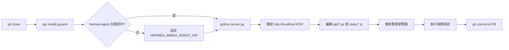
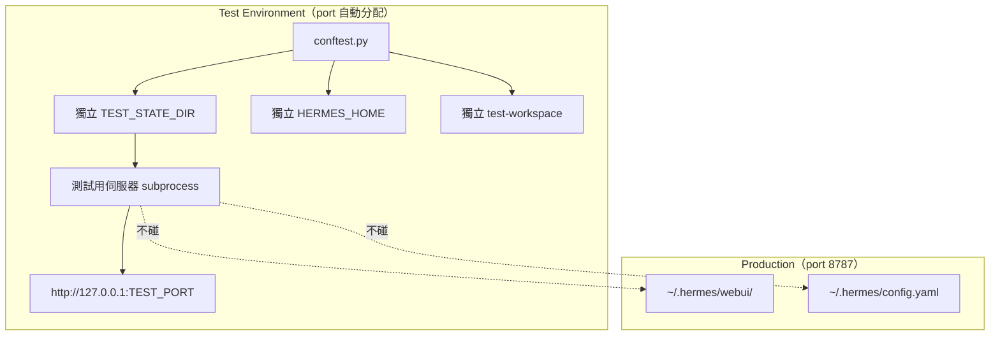
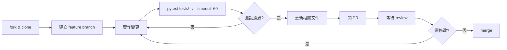

# Hermes Web UI — 開發者上手指南

> **版本**：基於 v0.50.245（2026-04-30）  
> **適用對象**：初次接觸此 repo 的貢獻者與維護者

---

## 目錄

1. [Prerequisites 與環境建置](#1-prerequisites-與環境建置)
2. [本地開發 Workflow](#2-本地開發-workflow)
3. [測試策略與執行方式](#3-測試策略與執行方式)
4. [新增 API Endpoint 標準 Pattern](#4-新增-api-endpoint-標準-pattern)
5. [新增前端 Panel 標準 Pattern](#5-新增前端-panel-標準-pattern)
6. [Debugging 技巧](#6-debugging-技巧)
7. [常見踩坑（Critical Rules）](#7-常見踩坑critical-rules)
8. [Contribution Workflow](#8-contribution-workflow)
9. [架構關鍵規則摘要（RULE-1 到 RULE-9）](#9-架構關鍵規則摘要rule-1-到-rule-9)

---

## 1. Prerequisites 與環境建置

### 1.1 系統需求

| 需求 | 最低版本 | 說明 |
|------|---------|------|
| Python | 3.11 | CI 測試 3.11、3.12、3.13 三個版本 |
| Git | 任意近期版本 | - |
| hermes-agent | 最新版 | NousResearch 出品，需獨立安裝 |
| Docker（選用） | 20.10+ | 容器化部署 |

**直接依賴只有一個**：`pyyaml>=6.0`。所有 AI/agent 依賴住在 hermes-agent 的 venv 中，不影響 WebUI。

### 1.2 安裝 hermes-agent（前置作業）

```bash
# hermes-agent 需位於以下任一路徑（由 api/config.py 自動偵測）：
~/.hermes/hermes-agent/
../hermes-agent/          # 相鄰 checkout
~/hermes-agent/

# 驗證 agent 路徑正確
ls ~/.hermes/hermes-agent/run_agent.py
```

或設定環境變數明確指定：

```bash
export HERMES_WEBUI_AGENT_DIR=/path/to/hermes-agent
```

### 1.3 Clone 與安裝 WebUI 依賴

```bash
git clone https://github.com/nesquena/hermes-webui.git
cd hermes-webui
pip install -r requirements.txt   # 只有 pyyaml>=6.0
```

### 1.4 設定 config.yaml（hermes-agent 設定）

```bash
mkdir -p ~/.hermes
cat > ~/.hermes/config.yaml << 'EOF'
model: anthropic/claude-sonnet-4.6
fallback_model: openai/gpt-5.4-mini

providers:
  - name: anthropic
    api_key: ${ANTHROPIC_API_KEY}
  - name: openai
    api_key: ${OPENAI_API_KEY}
EOF
```

### 1.5 環境變數（可選）

複製範本並按需調整：

```bash
cp .env.example .env
```

| 常用變數 | 預設值 | 說明 |
|---------|--------|------|
| `HERMES_WEBUI_HOST` | `127.0.0.1` | Bind address |
| `HERMES_WEBUI_PORT` | `8787` | HTTP 端口（測試用 8788） |
| `HERMES_WEBUI_STATE_DIR` | `~/.hermes/webui` | Session 儲存目錄 |
| `HERMES_WEBUI_DEFAULT_MODEL` | `openai/gpt-5.4-mini` | 預設模型 |
| `HERMES_WEBUI_PASSWORD` | 未設定 | 設定後啟用密碼認證 |

---

## 2. 本地開發 Workflow

### 2.1 開發流程圖



### 2.2 啟動開發伺服器

```bash
# 方法 1：直接啟動
python server.py

# 方法 2：一鍵啟動（自動偵測 agent、安裝依賴、開啟瀏覽器）
python bootstrap.py
# 或
bash start.sh

# 方法 3：背景 daemon 模式（含 log 管理）
bash ctl.sh start
bash ctl.sh status
bash ctl.sh logs
bash ctl.sh stop
```

### 2.3 無 Build Step 的開發優勢

這個專案**刻意不用** bundler、build step 或前端框架：

- 修改 `static/*.js` 後直接重新整理瀏覽器即可看到效果
- 修改 `api/*.py` 後只需重啟伺服器（`Ctrl+C` 再 `python server.py`）
- 前端使用 Vanilla JavaScript（ES2017+），直接以 `<script>` tag 載入

### 2.4 專案關鍵路徑

| 檔案 | 作用 | 大小 |
|------|------|------|
| `server.py` | 入口點、路由分發（薄 shell） | ~154 行 |
| `api/routes.py` | 所有 GET/POST/PATCH/DELETE handlers | ~2250+ 行 |
| `api/config.py` | 設定載入、全域狀態、model 偵測 | ~1110 行 |
| `api/streaming.py` | SSE engine、run_agent、cancel | ~660 行 |
| `api/models.py` | Session model + CRUD + CLI bridge | ~377 行 |
| `api/helpers.py` | HTTP 工具函式（`j()`, `t()`, `bad()`, `read_body()`） | ~175 行 |
| `static/ui.js` | DOM helpers、renderMd、tool cards | ~1740 行 |
| `static/panels.js` | Cron/Skills/Memory/Profiles/Settings | ~1438 行 |

### 2.5 設定載入優先順序

```
環境變數（最高優先）
    ↓
~/.hermes/config.yaml（hermes-agent 設定）
    ↓
~/.hermes/webui/settings.json（WebUI 使用者設定）
    ↓
api/config.py 中的 hardcoded defaults（最低優先）
```

---

## 3. 測試策略與執行方式

### 3.1 測試規模

- **366 個** test 檔案（`tests/test_*.py`）
- **3309+** tests（持續增加中）
- 自動化 CI：GitHub Actions，Python 3.11、3.12、3.13 三個版本並行

### 3.2 測試架構（隔離設計）



`tests/conftest.py` 的 port 分配機制：

```python
# tests/conftest.py — port 由 repo 路徑的 MD5 hash 決定（20000-29999），
# 確保不同 worktree 不衝突。可用 HERMES_WEBUI_TEST_PORT 覆蓋。
def _auto_test_port(repo_root) -> int:
    import hashlib
    h = int(hashlib.md5(str(repo_root).encode()).hexdigest(), 16)
    return 20000 + (h % 10000)
```

### 3.3 執行測試

```bash
# 執行全部測試（推薦）
pytest tests/ -v --timeout=60

# 執行單一測試檔
pytest tests/test_sprint1.py -v --timeout=60

# 只執行特定 test
pytest tests/test_sprint1.py::test_health -v

# 快速收集（不執行，確認 test 數量）
pytest tests/ --collect-only -q

# 並行加速（需安裝 pytest-xdist）
pytest tests/ -n auto --timeout=60
```

### 3.4 在測試中存取伺服器

```python
# tests/conftest.py 提供的 fixture
def test_example(server):
    """server fixture 確保測試伺服器已啟動"""
    import urllib.request
    url = f"http://127.0.0.1:{TEST_PORT}/health"
    with urllib.request.urlopen(url) as r:
        data = json.loads(r.read())
    assert data["status"] == "ok"
```

---

## 4. 新增 API Endpoint 標準 Pattern

### 4.1 後端：在 `api/routes.py` 新增

#### GET Endpoint

在 `handle_get()` 函式（`api/routes.py:2034`）中，於 404 fallback **之前**新增：

```python
# api/routes.py — handle_get() 中加入
if parsed.path == "/api/my-feature":
    # 1. 讀取必要的 query params
    from urllib.parse import parse_qs
    params = parse_qs(parsed.query)
    sid = params.get("session_id", [None])[0]

    # 2. 驗證必要參數
    if not sid:
        return bad(handler, "session_id is required")

    # 3. 取得 session（使用 try/except，不用 .get()）
    try:
        session = get_session(sid)
    except KeyError:
        return bad(handler, "Session not found", status=404)

    # 4. 業務邏輯
    result = {"feature_data": session.some_field}

    # 5. 回傳 JSON（使用 j() helper）
    return j(handler, result)
```

#### POST Endpoint

在 `handle_post()` 函式（`api/routes.py:2879`）中，注意順序：

```python
# api/routes.py — handle_post() 中加入（必須在 read_body() 之後！）
#
# 結構如下（順序不可亂）：
# 1. /api/upload 檢查（在 read_body() 之前！）
# 2. read_body(handler)  ← 此行消費 request body
# 3. 你的新 endpoint  ← 必須在這裡
# 4. 404 fallback

if parsed.path == "/api/my-feature/create":
    # body 已由 read_body() 解析完畢
    try:
        require(body, "name", "value")  # api/helpers.py:require()
    except ValueError as e:
        return bad(handler, str(e))

    try:
        sid = body.get("session_id")
        session = get_session(sid)
    except KeyError:
        return bad(handler, "Session not found", status=404)

    # 業務邏輯
    session.some_field = body["value"]
    session.save()

    return j(handler, {"ok": True, "id": session.session_id})
```

### 4.2 核心 Helper 函式（`api/helpers.py`）

| 函式 | 用途 | 範例 |
|------|------|------|
| `j(handler, payload, status=200)` | 回傳 JSON（含 gzip、安全標頭） | `return j(handler, {"ok": True})` |
| `t(handler, payload, status=200)` | 回傳純文字或 HTML | `return t(handler, "<h1>OK</h1>", content_type="text/html")` |
| `bad(handler, msg, status=400)` | 回傳 JSON 錯誤 | `return bad(handler, "Missing field")` |
| `require(body, *fields)` | 驗證必要欄位 | `require(body, "session_id", "message")` |
| `read_body(handler)` | 讀取並解析 POST body（20MB 上限） | `body = read_body(handler)` |
| `safe_resolve(root, path)` | 防 path traversal 的路徑解析 | `p = safe_resolve(workspace_path, user_input)` |
| `redact_session_data(session_dict)` | 過濾 API response 中的 API key | `return j(handler, redact_session_data(s.compact()))` |

### 4.3 撰寫對應測試

新增 endpoint 後，在 `tests/` 目錄新增測試：

```python
# tests/test_my_feature.py
import json
import urllib.request
import pytest

def test_my_feature_get(server):
    """測試新的 GET endpoint"""
    url = f"{server}/api/my-feature?session_id=nonexistent"
    req = urllib.request.Request(url)
    try:
        with urllib.request.urlopen(req) as r:
            pass
    except urllib.error.HTTPError as e:
        assert e.code == 404

def test_my_feature_create(server):
    """測試新的 POST endpoint"""
    # 先建立 session
    payload = json.dumps({}).encode()
    req = urllib.request.Request(
        f"{server}/api/session/new",
        data=payload,
        headers={"Content-Type": "application/json"},
        method="POST"
    )
    with urllib.request.urlopen(req) as r:
        data = json.loads(r.read())
    sid = data["session"]["session_id"]

    # 測試新 endpoint
    payload = json.dumps({"session_id": sid, "name": "test", "value": 42}).encode()
    req = urllib.request.Request(
        f"{server}/api/my-feature/create",
        data=payload,
        headers={"Content-Type": "application/json"},
        method="POST"
    )
    with urllib.request.urlopen(req) as r:
        result = json.loads(r.read())
    assert result["ok"] is True
```

---

## 5. 新增前端 Panel 標準 Pattern

### 5.1 前端檔案結構

前端無 build step，直接修改 `static/` 目錄下的 JS 檔案：

| 檔案 | 用途 |
|------|------|
| `static/panels.js` | 主要 panel 邏輯（Cron/Skills/Memory/Profiles/Settings） |
| `static/ui.js` | 共用 DOM helpers、renderMd |
| `static/sessions.js` | Session CRUD、sidebar 渲染 |
| `static/messages.js` | 訊息發送、SSE 串流處理 |
| `static/index.html` | HTML 模板（panel tab 定義在這裡） |

### 5.2 新增 Panel 步驟

**Step 1：在 `static/index.html` 加入 tab 按鈕（約第 600 行的 tab row）**

```html
<!-- static/index.html — 在 panel tab row 中加入 -->
<button class="panel-tab" data-panel="my-panel" title="My Panel">
  <!-- 使用 static/icons.js 中的 SVG icon -->
</button>
```

**Step 2：在 `static/index.html` 加入 panel 容器**

```html
<!-- static/index.html — panel 內容區 -->
<div id="my-panel" class="panel-section" hidden>
  <div class="panel-header">
    <h3>My Panel</h3>
  </div>
  <div class="panel-body" id="my-panel-body">
    <!-- 動態內容由 JS 填入 -->
  </div>
</div>
```

**Step 3：在 `static/panels.js` 實作 panel 邏輯**

```javascript
// static/panels.js — 新增 panel 函式

// Panel 初始化（由 tab 切換時呼叫）
async function initMyPanel() {
  const container = document.getElementById('my-panel-body');
  container.innerHTML = '<p>Loading...</p>';

  try {
    // 呼叫後端 API
    const resp = await fetch('/api/my-feature');
    if (!resp.ok) throw new Error(`HTTP ${resp.status}`);
    const data = await resp.json();

    // 渲染內容
    container.innerHTML = renderMyPanelContent(data);

    // 綁定事件
    container.querySelectorAll('.my-panel-btn').forEach(btn => {
      btn.addEventListener('click', handleMyPanelAction);
    });
  } catch (e) {
    container.innerHTML = `<p class="error">Failed to load: ${e.message}</p>`;
  }
}

function renderMyPanelContent(data) {
  return data.items.map(item => `
    <div class="my-panel-item">
      <span>${escapeHtml(item.name)}</span>
      <button class="my-panel-btn" data-id="${item.id}">Action</button>
    </div>
  `).join('');
}

async function handleMyPanelAction(e) {
  const id = e.currentTarget.dataset.id;
  const resp = await fetch('/api/my-feature/create', {
    method: 'POST',
    headers: {'Content-Type': 'application/json'},
    body: JSON.stringify({ id })
  });
  if (resp.ok) await initMyPanel(); // 重新整理 panel
}
```

**Step 4：在 tab 切換的事件監聽中加入初始化呼叫**

```javascript
// static/panels.js 或 static/boot.js — 在 tab switch handler 中加入
document.querySelectorAll('.panel-tab').forEach(tab => {
  tab.addEventListener('click', async () => {
    const panelName = tab.dataset.panel;
    if (panelName === 'my-panel') {
      await initMyPanel();
    }
    // ...其他 panels
  });
});
```

---

## 6. Debugging 技巧

### 6.1 Health Check

```bash
# 確認伺服器存活
curl -s http://127.0.0.1:8787/health
# 期望回應：{"status": "ok"}

# 測試伺服器（port 由 conftest.py 自動分配）
TEST_PORT=$(python -c "
import hashlib, pathlib
r = pathlib.Path('.').resolve()
print(20000 + int(hashlib.md5(str(r).encode()).hexdigest(), 16) % 10000)
")
curl -s http://127.0.0.1:${TEST_PORT}/health
```

### 6.2 Log 查看

```bash
# daemon 模式的 log
bash ctl.sh logs
bash ctl.sh logs -f   # 即時追蹤

# 直接啟動時的 stderr
python server.py 2>&1 | tee /tmp/hermes-webui.log

# 追蹤 log
tail -f /tmp/hermes-webui.log
```

### 6.3 常用 curl 範例

```bash
BASE="http://127.0.0.1:8787"

# 建立新 session
curl -s -X POST "$BASE/api/session/new" \
  -H "Content-Type: application/json" \
  -d '{}' | python -m json.tool

# 列出所有 sessions
curl -s "$BASE/api/sessions" | python -m json.tool

# 取得 session 詳情
curl -s "$BASE/api/session?session_id=SESSION_ID" | python -m json.tool

# 取得設定
curl -s "$BASE/api/settings" | python -m json.tool

# 更新設定
curl -s -X POST "$BASE/api/settings" \
  -H "Content-Type: application/json" \
  -d '{"default_model": "anthropic/claude-sonnet-4.6"}' | python -m json.tool
```

### 6.4 SSE 串流 Debug

```bash
# 追蹤 SSE 串流（run 訊息）
curl -s -N "$BASE/api/stream?session_id=SESSION_ID"

# 追蹤 gateway session 更新
curl -s -N "$BASE/api/gateway/stream"
```

### 6.5 State 目錄檢查

```bash
# 查看 session 狀態
ls ~/.hermes/webui/sessions/
cat ~/.hermes/webui/sessions/_index.json | python -m json.tool

# 查看使用者設定
cat ~/.hermes/webui/settings.json | python -m json.tool
```

---

## 7. 常見踩坑（Critical Rules）

這些規則都曾在 codebase 中被打破然後修復，不要重蹈覆轍。

### RULE-2：upload 必須在 `read_body()` 之前

```python
# api/routes.py — handle_post() 的正確順序（約第 2879 行）

def handle_post(handler, parsed) -> bool:
    # ✅ 正確：upload 在 read_body() 之前
    if parsed.path == "/api/upload":
        return handle_upload(handler)      # 自己讀取 body

    body = read_body(handler)              # 消費 body

    # ✅ 正確：其他 endpoints 在 read_body() 之後
    if parsed.path == "/api/my-endpoint":
        ...
```

**原因**：`read_body()` 會消費整個 `handler.rfile`。Upload handler 需要直接讀取 multipart body，如果先呼叫 `read_body()` 則 body 已清空，upload 會失敗。（`api/routes.py:2884-2892`）

### RULE-3：`run_conversation()` 使用 `task_id=`，不是 `session_id=`

```python
# ❌ 錯誤（silently raises TypeError）
agent.run_conversation(session_id=sid, ...)

# ✅ 正確
agent.run_conversation(task_id=sid, ...)
```

**原因**：hermes-agent 的 `AIAgent.run_conversation()` 的參數名稱是 `task_id`，不是 `session_id`。使用錯誤的 kwarg 會靜默地 raise TypeError，導致 agent 完全不執行但前端以為成功。（`api/streaming.py`）

### 環境變數 process-global 問題（RULE 衍生）

```python
# api/streaming.py — _run_agent_streaming() 中的正確做法
# HERMES_HOME 是 process-global 環境變數，在 ThreadingHTTPServer 多執行緒下有 race condition

# ✅ 正確：設定前記錄原值，結束後還原
original_home = os.environ.get('HERMES_HOME')
try:
    os.environ['HERMES_HOME'] = profile_home
    # ... run agent ...
finally:
    if original_home is None:
        os.environ.pop('HERMES_HOME', None)
    else:
        os.environ['HERMES_HOME'] = original_home
```

**原因**：多個 browser tab 同時使用不同 profile 時，profile 各自設定 `HERMES_HOME`。如果不還原，後續請求可能繼承錯誤的 profile 環境。（`api/profiles.py:get_profile_runtime_env()`）

### RULE-1：`deleteSession()` 不能呼叫 `newSession()`

```javascript
// static/sessions.js — deleteSession() 正確行為
async function deleteSession(sid) {
  await fetch(`/api/session?session_id=${sid}`, { method: 'DELETE' });

  // ✅ 正確：刪除後看還有沒有其他 sessions
  if (S.sessions.length > 0) {
    await loadSession(S.sessions[0].session_id);  // 載入第一個
  } else {
    showEmptyState();  // 顯示空狀態，不建立新 session
  }

  // ❌ 錯誤（舊 bug）：
  // await newSession();  // 刪除後不應自動建立
}
```

### RULE-4：SSE stream_delta_callback 的 None sentinel

```python
# api/streaming.py — 正確的 on_token callback
def on_token(text):
    if text is None:  # ✅ 必須檢查 None（end-of-stream sentinel）
        return
    send_sse_token(text)
```

### RULE-7：SESSIONS dict 存取必須持有 LOCK

```python
# api/models.py（或 streaming.py）— 正確的執行緒安全存取
with LOCK:
    session = SESSIONS.get(sid)
    if session:
        session.messages.append(msg)
```

### RULE-8：不要把 traceback 回傳給 API client

```python
# ❌ 錯誤
except Exception as e:
    return j(handler, {"error": str(e), "traceback": traceback.format_exc()}, status=500)

# ✅ 正確
except Exception:
    logger.exception("my_endpoint failed")
    return j(handler, {"error": "Internal server error"}, status=500)
```

---

## 8. Contribution Workflow

### 8.1 流程概述



### 8.2 PR 規範（來自 `CONTRIBUTING.md`）

每個 PR 必須包含：

1. **Thinking Path**：說明從專案目標到具體修改的推理鏈
2. **What Changed**：修改了什麼
3. **Why It Matters**：為何需要這個修改
4. **Verification**：如何驗證（測試指令、截圖）
5. **Risks / Follow-ups**：潛在風險與後續工作
6. **Model Used**：使用的 AI model（若無 AI 協助則寫 `None — human-authored`）

UI/UX 變更**必須附上** before/after 截圖，否則 PR 會被忽略。

### 8.3 文件更新原則

修改行為或架構時，同一 PR 中必須更新：

| 變更類型 | 需更新的文件 |
|---------|------------|
| API endpoint 新增/修改 | `ARCHITECTURE.md`（Section 4.1 routing table） |
| Bug 修復 | `ARCHITECTURE.md`（Section 9）、`BUGS.md` |
| 設定或 setup 變更 | `README.md` |
| 測試說明 | `TESTING.md` |
| 使用者可見功能 | `CHANGELOG.md` |
| 設計限制或踩坑 | `ARCHITECTURE.md`（Section 17 Critical Rules） |

### 8.4 分支策略

```bash
# 小型修改：從 main 開分支
git checkout -b fix/delete-session-bug

# 大型功能：先開 issue 或 draft PR 對齊方向，再實作
git checkout -b feat/new-panel-my-feature
```

### 8.5 CI 檢查

GitHub Actions 在每個 PR 上執行：
- Python 3.11、3.12、3.13 三個版本的 `pytest tests/ -v --timeout=60`
- Multi-arch Docker build（amd64 + arm64）

本地先跑測試，避免 CI 失敗：

```bash
pytest tests/ -v --timeout=60
```

---

## 9. 架構關鍵規則摘要（RULE-1 到 RULE-9）

完整規則定義在 `ARCHITECTURE.md:1223-1257`，以下為快速參考：

| 規則 | 核心描述 | 涉及模組 |
|------|---------|---------|
| **RULE-1** | `deleteSession()` **絕不**呼叫 `newSession()`。刪除後若還有 sessions 則載入第一個，若無則顯示空狀態。 | `static/sessions.js` |
| **RULE-2** | `/api/upload` 必須在 `read_body()` **之前**檢查。`read_body()` 會消費 body，upload 自己解析 multipart。 | `api/routes.py:2884` |
| **RULE-3** | `run_conversation()` 使用 `task_id=` 關鍵字參數，**不是** `session_id=`。錯誤的 kwarg 靜默失敗。 | `api/streaming.py` |
| **RULE-4** | `stream_delta_callback` 收到 `None` 代表串流結束（end-of-stream sentinel）。callback 必須守門：`if text is None: return` | `api/streaming.py` |
| **RULE-5** | `send()` 必須在任何 `await` **之前**捕捉 `activeSid`。await 期間 active session 可能已切換。 | `static/messages.js` |
| **RULE-6** | Boot IIFE **絕不**自動建立 session。建立 session 只有兩個入口：+ 按鈕、`send()` 在 `S.session` 為 null 時。 | `static/boot.js` |
| **RULE-7** | 所有 `SESSIONS` dict 存取必須持有 `LOCK`（`threading.Lock()`）。`with LOCK: session = SESSIONS[sid]` | `api/models.py`、`api/streaming.py` |
| **RULE-8** | **不要**把 traceback 回傳給 API client。500 回應只回傳 `{"error": "Internal server error"}`，traceback 留在 server log。 | `api/routes.py` |
| **RULE-9** | Multi-pattern approval 使用 `pattern_keys`（複數），不是 `pattern_key`（單數，legacy）。必須 iterate `pattern_keys`。 | `api/routes.py`（approval 相關） |

---

## 附錄：快速參考

### 狀態目錄結構

```
~/.hermes/webui/               # HERMES_WEBUI_STATE_DIR
├── sessions/
│   ├── _index.json            # Session 索引（O(1) lookup）
│   └── <session_id>.json      # 每個 session 的完整資料
├── settings.json              # 使用者設定
├── workspaces.json            # 已登錄 workspace 清單
├── projects.json              # Session 群組
├── .sessions.json             # Auth session tokens（HMAC，0600）
└── .signing_key               # HMAC signing key（0600，啟動時自動生成）
```

### 重要路徑速查

| 目的 | 路徑 |
|------|------|
| 新增 GET 路由 | `api/routes.py` → `handle_get()` |
| 新增 POST 路由 | `api/routes.py` → `handle_post()`（在 `read_body()` 之後） |
| Session CRUD | `api/models.py` |
| SSE 串流邏輯 | `api/streaming.py` |
| 設定載入 | `api/config.py:load_settings()` |
| 測試基礎設施 | `tests/conftest.py` |
| 前端 Panel | `static/panels.js` |
| 前端 DOM helpers | `static/ui.js` |
