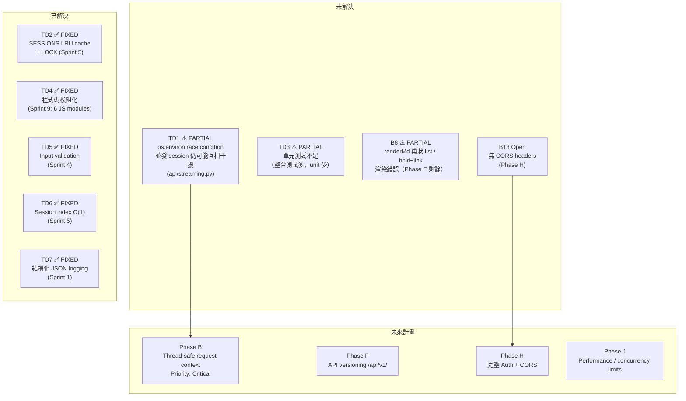

# DISCOVERY_LOG.md — Hermes Web UI 探索紀錄與待解問題

> 版本基礎：v0.50.245（April 30, 2026）；GitHub 最新 v0.50.291（May 4, 2026）  
> 撰寫日期：2026-05-05

---

## 1. Web Search 發現摘要

| 資源 | URL | 關鍵 Takeaway |
|------|-----|--------------|
| GitHub Repo | https://github.com/nesquena/hermes-webui | 66 contributors；v0.50.291 為最新 release |
| 官方網站 | https://nesquena.github.io/hermes-webui/ | 定位：Hermes Agent 的最佳 UI 入口 |
| Hermes Agent 官網 | https://hermes-agent.nousresearch.com/ | 上游 agent；WebUI 是其瀏覽器端介面 |
| GHCR 映像檔 | `ghcr.io/nesquena/hermes-webui:latest` | 每次 tag push 自動 build，支援 amd64 + arm64 |
| newreleases.io | https://newreleases.io/project/github/nesquena/hermes-webui | 版本追蹤，可訂閱通知 |

**v0.50.x 里程碑摘要**：
- `v0.50.0`（PR #242）：@aronprins 主導的 UI 大改版（三面板佈局、Composer footer、Hermes Control Center）
- `v0.50.245`：SSE-driven session sidebar、gateway session sync、Profile 系統、i18n、PWA、Extensions

**Hermes Agent 近況（2026-05）**：agent 端新增 4 個 inference providers、第 18/19 個 messaging 平台（含 Teams plugin）、Native Spotify + Google Meet 整合。這些 agent 端變更**可能需要 WebUI 端的對應 API 更新**，目前狀態未確認。

**社群已知問題（截至搜尋日期）**：
- WSL2 + Podman 3.4 的 `keep-id` 限制（建議升級 Podman 4+）
- Docker 兩容器模式下工具在 WebUI 容器執行（非 agent 容器）— 見 #681
- `.env: permission denied`（#1389）：`fix_credential_permissions()` 強制 0600，可設 `HERMES_SKIP_CHMOD=1` 繞過

---

## 2. 文件與程式碼落差清單

| # | ARCHITECTURE.md 所述 | 程式碼實際狀況 | 位置 | 嚴重程度 |
|---|---------------------|--------------|------|---------|
| G1 | `streaming.py` 約 236 行 | 實際超過 1800 行（含 STREAM_PARTIAL_TEXT、aux title 等新功能） | `api/streaming.py` | 低（文件未更新） |
| G2 | `server.py` 約 81 行 | 實際更長，含 TLS、FD limit、session recovery | `server.py` | 低（文件未更新） |
| G3 | `tests/` 有 21 test files | 實際有 **366 個** test files，3309 tests | `tests/` | 低（文件過時） |
| G4 | `api/` 模組清單較少 | 實際多出 `kanban_bridge.py`、`clarify.py`、`metering.py`、`session_ops.py`、`session_recovery.py`、`state_sync.py` 等 | `api/` | 中（新模組無說明） |
| G5 | Phase I 說「289 tests，14 test files」 | 已大幅增加（366 files，3309 tests） | `ARCHITECTURE.md:797` | 低（文件未跟上） |
| G6 | Phase B 標記為「Priority: Critical」 | `api/streaming.py` 仍有 process-global `os.environ` 寫入（interim fix 未完成） | `api/streaming.py:~1840` | **高（未解決的關鍵架構債）** |
| G7 | RULE-8 說「traceback is exposed; fix in Phase D」 | Phase D 標記 COMPLETE，但 `api/routes.py:5042` 仍有 synchronous urllib.request blocking warning | `api/routes.py:5042` | 中 |

---

## 3. 技術債（Technical Debt）完整狀態

| ID | 嚴重度 | 描述 | 狀態 | 位置 |
|----|--------|------|------|------|
| TD1 | Critical | `os.environ` process-global 寫入（並發 session 相互干擾） | **PARTIAL**（Sprint 5 加了 thread-local + per-session lock，但 process-level 寫入仍存在） | `api/streaming.py:~1835-1860` |
| TD2 | High | SESSIONS cache 無淘汰機制、缺鎖 | **FIXED**（Sprint 5）OrderedDict LRU cap 100 + LOCK | `api/models.py` |
| TD3 | High | 測試覆蓋率不足（unit tests 缺） | **PARTIAL**（整合測試已大量增加，unit 測試仍少） | `tests/` |
| TD4 | Medium | 所有程式碼在同一個檔案 | **FIXED**（Sprint 9）6 個 JS 模組 + Python `api/` | `static/*.js` |
| TD5 | Medium | 缺 request validation（KeyError → 500 traceback） | **FIXED**（Sprint 4）`require()`/`bad()` helpers | `api/helpers.py` |
| TD6 | Low | `all_sessions()` 每次全目錄掃描（O(N)） | **FIXED**（Sprint 5）`_index.json` O(1) 讀取 | `api/models.py` |
| TD7 | Low | 無結構化 logging | **FIXED**（Sprint 1）JSON per-request log | `server.py:log_request()` |

**最關鍵的未解技術債**：TD1 的 `os.environ` race condition 在多 session 並發時仍可能導致 `TERMINAL_CWD`、`HERMES_SESSION_KEY`、`HERMES_HOME` 互相覆蓋。Phase B 是真正的完整解，但尚未實施。

---

## 4. 已知 Bug 清單

| ID | 嚴重度 | 描述 | 狀態 | 修復位置 |
|----|--------|------|------|---------|
| B1 | Critical | Approval wiring 未測試；pattern_keys 未顯示 | **FIXED** Sprint 1 | `static/messages.js:showApprovalCard()` |
| B2 | High | File input 缺 `accept` 屬性 | **FIXED** Sprint 1 | `static/index.html` |
| B3 | High | Model chip 硬寫 sonnet 子字串判斷 | **FIXED** Sprint 1 | `api/config.py:MODEL_LABELS` |
| B4 | High | 重新整理頁面時 stream_id 遺失，無法重連 | **FIXED** Sprint 1 | `static/messages.js:checkInflightOnBoot()` |
| B5 | High | INFLIGHT 只在記憶體，頁面重整後消失 | **FIXED** Sprint 1 | `static/messages.js:markInflight()/clearInflight()` |
| B6 | Medium | 新 session 永遠使用 DEFAULT_WORKSPACE | **FIXED** Sprint 3 | `static/sessions.js:newSession()` |
| B7 | Medium | Sidebar 標題 overflow（缺 `min-width:0`） | **FIXED** Sprint 1 | `static/style.css` |
| B8 | Medium | `renderMd()` 巢狀 list / bold+link 混排渲染錯誤 | **PARTIAL** Sprint 4 | `static/ui.js:renderMd()` |
| B9 | Medium | 空的 assistant 訊息被渲染 | **FIXED** Sprint 1 | `static/sessions.js:loadSession()` |
| B10 | Low | Thinking dots 在 tool 執行時仍顯示 | **FIXED** Sprint 3 | `static/messages.js:on_tool handler` |
| B11 | Low | GET /api/session 無 ID 時靜默建立 session | **FIXED** Sprint 1 | `api/routes.py` → 回傳 400 |
| B12 | Low | Preview panel `display:none` → flex 布局跳動 | **FIXED** Sprint 4 | `static/style.css`（visibility/opacity transition） |
| B13 | Low | 無 CORS headers | **Open**（Phase H） | `api/helpers.py` |
| B14 | Low | 無新對話鍵盤快捷鍵 | **FIXED** Sprint 3 | `static/boot.js`（Cmd/Ctrl+K） |

**目前 BUGS.md 標記為 open 的 bug**：B13（CORS）外，文件記載的 Known Limitations 有：
- `#681`：兩容器 Docker 下 tool 在 WebUI 容器執行
- `#641`：CDN-rotated 圖片 URL 不一致
- `#628`：MCP tools 在 WebUI sessions 不可用
- `#195`：`os.environ` race condition（即 TD1）

---

## 5. Critical Rules（RULE-1 到 RULE-9）

這些規則是反覆被踩到、修復後又重新引入的陷阱（引自 `ARCHITECTURE.md:1225-1256`）：

| Rule | 規則 | 為何重要 |
|------|------|---------|
| RULE-1 | `deleteSession()` 絕對不能呼叫 `newSession()` | 刪除後不需要新 session；自動建立會造成幽靈 session，干擾使用者流程 |
| RULE-2 | `/api/upload` 必須在 `read_body()` 之前檢查 | `read_body()` 會消費 request body；upload 解析也需要 body。若順序錯誤，body 被消費後 upload 無法讀取任何內容 |
| RULE-3 | `run_conversation()` 傳入 `task_id=`，**不是** `session_id=` | `session_id=` 這個 keyword 在 AIAgent 中不存在，會靜默觸發 `TypeError`；此 bug 極難偵錯 |
| RULE-4 | `stream_delta_callback` 接收 `None` 作為 end-of-stream sentinel | `on_token` callback 必須守衛 `if text is None: return`，否則對 None 做字串操作會 crash |
| RULE-5 | `send()` 必須在任何 `await` 之前捕捉 `activeSid` | 等待過程中使用者可能切換 session；若未預先捕捉，done event 會更新錯誤 session 的 UI |
| RULE-6 | Boot IIFE 絕對不能自動建立 session | 只有「+ 按鈕」和「`send()` 時 `S.session` 為 null」才應建立 session；自動建立導致空白 session 汙染 sidebar |
| RULE-7 | 所有 `SESSIONS` dict 存取都必須持有 `LOCK` | 多執行緒環境下，未加鎖的 dict 操作會導致 `RuntimeError: dictionary changed size during iteration` |
| RULE-8 | 不能在 API response 中暴露 traceback | 500 response 應回傳 `{"error": "Internal server error"}`，完整 traceback 暴露 server 內部結構 |
| RULE-9 | Approval 使用 `pattern_keys`（複數），不是 `pattern_key` | approval module 可能含有 `pattern_key`（legacy）和 `pattern_keys`（複數，所有匹配 pattern）；必須 iterate `pattern_keys` 才能正確授權多 pattern |

---

## 6. 未解答的疑問與模糊地帶

### 6.1 hermes-agent 介面穩定性

- `AIAgent` class 的完整 constructor signature 和 `run_conversation()` 的所有回傳欄位是否有文件？目前只能從 WebUI 的呼叫方式反推。
- hermes-agent 近期新增的 4 個 inference providers（2026-05）是否已在 WebUI 的 model selector 中正確顯示？`api/config.py:resolve_model_provider()` 是否需要更新？

### 6.2 Gateway Platform 支援範圍

- `api/gateway_watcher.py` 目前透過 SSE 同步的 messaging platform 確認支援 Telegram/Discord/Slack，但 Signal、Email 及其他 10+ 平台的支援程度「未驗證」（`integrations.md` 中有明確標注）。
- `gateway_watcher` 輪詢頻率？若 gateway session DB 被 agent 端鎖住，WebUI 的行為為何？

### 6.3 Profile 切換的 Race Condition

- `switch_profile()` 會重新載入 config、skills、memory、models、cron；若在 agent 執行中途切換 profile，行為未定義。`_ENV_LOCK` 是否覆蓋此情境？

### 6.4 Claude Code Session Import

- `api/models.py:_iter_claude_code_jsonl_files()` / `_parse_claude_code_jsonl()` 讀取 `~/.claude/projects/`，但此功能在文件中幾乎沒有描述。目前 UI 觸發點在哪裡？是否已完整整合？

### 6.5 前端 Slash Command Extension

- `static/commands.js` 的 command registry 是 plain array，理論上 extension script 可注入自訂命令，但此行為**未經驗證**（`extensions.md` 明確標注）。

### 6.6 i18n 翻譯完整度

- `static/i18n.js` 中有約 20 個 onboarding 相關字串標注 `// TODO: translate`（行號 1712-1752），且 `session_toolsets` 相關字串（行號 2177-2179）尚未翻譯。目前非英文語言的 onboarding 體驗是否有 fallback？

### 6.7 `api/routes.py:5042` 同步 urllib.request

- `api/routes.py:5042` 有明確 WARNING 注解：「This uses synchronous urllib.request which blocks the worker thread」。在高並發下會阻塞 ThreadingHTTPServer 的 worker thread。實際影響範圍？是否有 workaround 計畫？

---

## 7. 上手這個專案最大的障礙

1. **hermes-agent 依賴**：WebUI 直接 `sys.path.insert` + `from run_agent import AIAgent`，沒有 agent 就無法測試核心功能。agent 本身未開源（NousResearch 產品），新進開發者需要申請存取或使用 mock。

2. **無 Web Framework，路由是 `if/elif` 鏈**：`api/routes.py`（~2250 行）全是手工 `if parsed.path == ...` 判斷，沒有 Flask/FastAPI 的 decorator routing。新增 endpoint 的正確位置（`/api/upload` 必須最先）需要靠讀 RULE-2 才知道。

3. **前端無 Build Step，也非 ES Modules**：`static/*.js` 用 `<script>` tag 以固定順序載入，全域變數互相依賴（`S`、`INFLIGHT`、`STREAMS` 等）。沒有 import/export，需要靠 `static/index.html` 的載入順序理解依賴關係。

4. **測試需要獨立的 hermes-agent 環境**：`tests/conftest.py` 雖然隔離了 port 和 state dir，但仍需要 hermes-agent 安裝。3309 個測試全是 HTTP 整合測試，幾乎沒有 unit test，單個邏輯的測試很難。

5. **ARCHITECTURE.md 是「活文件」但有落差**：這份文件極度詳盡（1274+ 行），但部分描述（行數統計、test file 數量、模組清單）已與實際程式碼脫節（見第 2 節落差清單）。閱讀時需要持續與原始碼對照。

6. **TD1 的 Thread-Safety 陷阱**：`os.environ` 在多 session 並發時的競態條件是已知問題，但 Phase B 的完整修復尚未實施。在測試 / 開發時若啟動多個並發 session，可能遇到難以重現的環境變數互蓋問題。

---

## 8. 建議優先深入的區域

| 優先度 | 區域 | 原因 |
|--------|------|------|
| P0 | `api/streaming.py`（`_run_agent_streaming()`） | 核心執行路徑，TD1 未解，Phase B 的修復目標 |
| P0 | `api/routes.py`（`handle_post()` 前段） | RULE-2 的關鍵排序區域；新 endpoint 必讀 |
| P1 | `api/models.py`（`Session.save()`、`all_sessions()`） | 原子寫入、LRU cache、index 機制 — 資料完整性的核心 |
| P1 | `static/messages.js`（`send()`、SSE handlers） | 前端主流程；RULE-4、RULE-5 的實作位置 |
| P2 | `api/profiles.py`（`switch_profile()`） | Profile 切換邏輯；有潛在 race condition（疑問 6.3） |
| P2 | `api/gateway_watcher.py` | Gateway session 同步；多 platform 支援程度未知 |
| P3 | `static/ui.js`（`renderMd()`） | B8 PARTIAL 的剩餘問題；手工 regex chain，高風險區 |
| P3 | `api/auth.py` | 安全邊界；rate limiting 邏輯的正確性 |

---

## 附錄：架構相位完成度

| Phase | 名稱 | 狀態 |
|-------|------|------|
| A | File Separation | COMPLETE |
| B | Thread-Safe Request Context | **PARTIAL（Critical）** |
| C | Session Store Improvements | COMPLETE |
| D | Input Validation & Error Handling | COMPLETE |
| E | Frontend Modularization | COMPLETE（renderMd 除外） |
| F | API Design Cleanup（versioning） | **Not Started** |
| G | Observability | MOSTLY COMPLETE（`/api/debug/stats` 未實作） |
| H | Authentication + CORS | PARTIAL（auth 已實作，CORS B13 open） |
| I | Test Infrastructure | COMPLETE（unit tests 仍少） |
| J | Performance / Concurrency Limits | **Not Started** |

---

## 增量更新紀錄（2026-05-05）

**Base Commit 範圍**：`e23ba59..fcc8328`（v0.50.245 → v0.51.2）  
**變更幅度**：8 個檔案 / 484 個（1.7%）

### 新功能

**Logs Tab MVP**（`af1c628`）
- 新 sidebar panel `panelLogs`，提供 agent / errors / gateway 三個 log 檔案的即時檢視
- 後端 `GET /api/logs?file=agent|errors|gateway&tail=200`，白名單保護、最大 4 MB
- 每 5 秒自動 refresh（`_logsAutoRefreshTimer`）；行級別顏色（WARNING=黃、ERROR/CRITICAL=紅）
- 附 wrap toggle 與 copy all 功能

**LLM Wiki Status Panel**（`2684d6f`）
- Insights panel 新增 `wiki-status-card`：顯示 LLM Wiki 啟用狀態、路徑、頁面數
- 後端 `GET /api/wiki/status`，由 `_build_llm_wiki_status()` 組裝

### 邏輯改進

**CLI Session Filtering**（PR #1587，`79d0762`-`d76ef2a`）
- 新常數：`CLI_MIN_UNTITLED_MESSAGE_COUNT = 6`、`CLI_MIN_UNTITLED_USER_MESSAGE_COUNT = 2`
- 低價值 CLI session（Untitled、空對話）需有 ≥6 messages 且 ≥2 user messages 才在 sidebar 顯示
- `CLI_VISIBLE_SESSION_LIMIT = 20`：CLI sessions 上限
- `Session.compact()` 新增 `user_message_count` 欄位（用於過濾判斷）

### Bug Fix

**Sidebar scroll fix**（#1669，`4e9ec6f`）
- 修復：session 列表 ≤80 個時 scroll 跳回頂部的問題（`static/sessions.js`）
